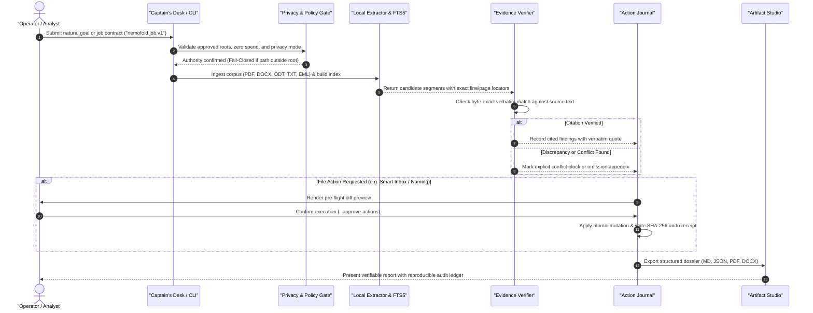

# NemoFold

English | [Deutsch](README_de.md)

[](https://youtu.be/wOToLqDBvvE)

**Demo video (2:16):** https://youtu.be/wOToLqDBvvE · built for the Nebius x NVIDIA Global AI Hackathon

[](pyproject.toml)
[](https://github.com/ellmos-ai/NemoFold/actions/workflows/ci.yml)
[](tests/)
[-blue.svg)](.github/workflows/ci.yml)
[%20%7C%20macOS%20(mypy)-lightgrey.svg)](.github/workflows/ci.yml)
[](#5-governance--runtime-invariants)
[](THIRD_PARTY_LICENSES.md)
[](SECURITY.md)
[](LICENSE)
[](THIRD_PARTY_LICENSES.md)
[](https://github.com/ellmos-ai)
[](https://github.com/open-bricks)
[](llms.txt)

<a id="1-overview--core-mission"></a><a id="1-uebersicht--kernmission"></a>
<a id="overview--core-mission"></a><a id="uebersicht--kernmission"></a>
## 1. Overview & Core Mission

**Turn documents into data. NemoFold puts your knowledge to work.**

NemoFold adapts to your use cases — a growing library, not fine-tuning.

NemoFold is a private, evidence-first document agent. It turns explicitly approved
folders into a persistent working memory, keeps claims traceable to source locations,
and makes file actions reversible.

Working tagline: **Your files. Your rules. Your agent.**

This repository is the competition implementation for the Nebius x NVIDIA Global
AI Hackathon. The local core is deliberately usable without a cloud account. The
Nemotron-on-Nebius integration is proven by a real, sanitized Token Factory run whose
complete receipt chain is committed under `examples/proven-run/` and can be re-verified
offline (see [Section 11](#11-approved-nebius-token-factory-run)).

Its document workflows are compositions of four shared primitives: schema-bound
field extraction, deduplication that keeps what it strikes, section-wise merging with
visible conflicts, and a delta against a named snapshot. Because those primitives are
shared rather than private to one workflow, the same building blocks can be chained
for a case nobody has written a workflow for yet.

It adapts to your use cases in two honest ways: the Captain's Desk plans new
combinations of existing primitives from one plain sentence, and every prepared voyage
becomes a reusable draft. That is the whole learning story - a growing library of
voyages, not a model that trains on your files. Nothing is fine-tuned, and nothing
about your documents leaves the host unless you approve that specific transfer.

The same core serves both ends of the range: everyday work on a laptop with a small
local model, and a data analyst pointing Nemotron on Nebius Token Factory at a large
corpus. The evidence contract does not change between them - only the worker does.

---

## Quick Navigation
| # | Section | Description |
|:---:|:---|:---|
| 1 | [Overview & Core Mission](#1-overview--core-mission) | Evidence-first document agent, local memory, and core value proposition |
| 2 | [Visual Architecture & Dual Diagrams](#2-visual-architecture--dual-diagrams) | Topology flowchart & end-to-end evidence lifecycle sequence diagram |
| 3 | [Target Personas & Discoverability](#3-target-personas--discoverability) | 4 user personas ([PERSONA-01] to [PERSONA-04]) & high-intent search queries |
| 4 | [Comparative Matrix vs. Alternatives](#4-comparative-matrix-vs-alternatives) | 10-dimension architectural matrix against 4 industry alternatives |
| 5 | [Governance & Runtime Invariants](#5-governance--runtime-invariants) | Core security guarantees: INV-LOCAL-01 through INV-SLA-10 |
| 6 | [Implemented Document Workflows](#6-implemented-document-workflows) | 43 production-ready workflows built from 4 shared primitives |
| 7 | [Installation & Quick Start](#7-installation--quick-start) | Environment setup, editable install, and CLI verification |
| 8 | [Offline Proof & Verification](#8-offline-proof--verification) | Local synthetic corpus verification, zero cloud proof, fail-closed path |
| 9 | [Executing Real Local Jobs](#9-executing-real-local-jobs) | Single-command workflow execution with preview and rollback |
| 10 | [Provider Adapters, MCP & API](#10-provider-adapters-mcp--api) | Ollama, LM Studio, Claude Code, OpenAI, Anthropic & stdio MCP server |
| 11 | [Approved Nebius Token Factory Run](#11-approved-nebius-token-factory-run) | Hackathon competition benchmark, NemoClaw package, verified tokens |
| 12 | [Voyage Library & Captain's Desk](#12-voyage-library--captains-desk) | Plain-sentence natural intent parsing into dry-run reusable drafts |
| 13 | [Case Chronicle Deep Analysis](#13-case-chronicle-deep-analysis) | Multi-stage chronological dossiers, incident analysis, timeline tracking |
| 14 | [Structured Sources & Controlled Output](#14-structured-sources--controlled-output) | CSV/JSON ingestion, sanitized web boundary, Controlled Email drafting |
| 15 | [Checking, Comparing & Composing](#15-checking-comparing--composing) | Reference check, Rater Race, Guide Compose, Wiki Export, Pattern Mining |
| 16 | [Local Web Console & Routes](#16-local-web-console--routes) | Area routing (`/folders`, `/processes`, `/governance`, `/connections`) |
| 17 | [Sibling Ecosystem & Integration](#17-sibling-ecosystem--integration) | Cross-reference table for 16 sister repositories across open-bricks |
| 18 | [Transparency, Licenses & Security Policy](#18-transparency-licenses--security-policy) | Dependency audit, zero-copyleft guarantee, 48h vulnerability SLA |

---

<a id="2-visual-architecture--dual-diagrams"></a><a id="2-visuelle-architektur--duale-diagramme"></a>
<a id="visual-architecture--dual-diagrams"></a><a id="visuelle-architektur--duale-diagramme"></a>
## 2. Visual Architecture & Dual Diagrams

### System Architecture Topology

```mermaid
flowchart TB
    subgraph Intake["1. Ingestion & Structured Sources Layer"]
        DOCS["Local Corpus<br/>(PDF, DOCX, ODT, TXT, CSV, JSON)"]
        MAILS["Mail-to-Case Intake<br/>(Read-Only RFC-822 .eml)"]
        WEB["Gated Web Sources<br/>(Sanitized HTML, Domain Boundary)"]
    end

    subgraph Memory["2. Local Memory & Persistent Index"]
        FTS["SQLite FTS5 Full-Text Store<br/>(BM25 Ranking, Token Offsets)"]
        REG["Document Registry<br/>(Declared Field Columns, Exact Locators)"]
        RESOLV["Version Resolver<br/>(Family Snapshot, Semantic Diffs)"]
    end

    subgraph Governance["3. Trust Boundary & Governance Gates"]
        ROOTS["Approved Roots Policy<br/>(Fail-Closed Directory Boundaries)"]
        GATES["Execution Gates<br/>(File Actions, External Models, Budget Ceiling)"]
        RUNAS["User Space Boundary<br/>(Unprivileged RunAsInvoker, Non-Elevated)"]
    end

    subgraph CoreEngine["4. Core Engine & Shared Primitives"]
        DESK["Captain's Desk<br/>(Natural Intent to Reusable Voyage)"]
        PRIM1["Primitive 1: Field Extraction<br/>(Schema-Bound Parsing)"]
        PRIM2["Primitive 2: Fact Distill<br/>(Deduplication with Omitted Appendix)"]
        PRIM3["Primitive 3: Synopsis Merge<br/>(Sectional Synthesis with Conflict Blocks)"]
        PRIM4["Primitive 4: Snapshot Delta<br/>(Continuous Folder Digest)"]
        JOURNAL["Reversible Action Journal<br/>(Preview, Atomic Apply, Instant Undo)"]
    end

    subgraph Surfaces["5. Delivery, MCP & Console Surfaces"]
        WEBAPP["Local Web Console<br/>(Loopback 127.0.0.1:8765, Area Routes)"]
        MCPSRV["Stdio MCP Server<br/>(nemofold-mcp Tool Provider)"]
        CLI["CLI Toolset<br/>(Strict nemofold.job.v1 Parser)"]
        REPORTS["Artifact Studio<br/>(SHA-256 Ledger, Markdown, PDF, DOCX)"]
    end

    Intake --> Memory
    Memory --> Governance
    Governance --> CoreEngine
    CoreEngine --> Surfaces
```



### Evidence-Grounded Workflow Lifecycle



---

<a id="3-target-personas--discoverability"></a><a id="3-zielgruppen--auffindbarkeit"></a>
<a id="target-personas--discoverability"></a><a id="zielgruppen--auffindbarkeit"></a>
## 3. Target Personas & Discoverability

### Target Personas

- **[PERSONA-01] Legal, Compliance & Due Diligence Analysts**
  - *Context:* Reviewing voluminous corporate contracts, disclosures, M&A dataroom records, and compliance checklists.
  - *Pain Point:* Commercial cloud AI tools ingest confidential filings into remote multi-tenant servers; LLM hallucinations invent clauses without verifiable source citations.
  - *Solution:* 100% offline analysis; claims require byte-exact verbatim citations with exact line and page locators; a checkmark without a quote is rejected as an opinion.

- **[PERSONA-02] Enterprise Privacy Officers & Knowledge Managers**
  - *Context:* Governing sensitive enterprise folders, internal HR records, healthcare dossiers, and intellectual property files.
  - *Pain Point:* Uncontrolled scripts accidentally overwrite or misplace files; cloud synchronization triggers GDPR/HIPAA cross-border breach liabilities.
  - *Solution:* Strict local allow-root boundary; path-free sanitized packaging; reversible file mutations with preview, resume, and instant journaled rollback.

- **[PERSONA-03] Autonomous Agent & Local LLM Developers**
  - *Context:* Integrating document intelligence into offline agent architectures, local desktop tools, or MCP tool orchestrations.
  - *Pain Point:* Fragile agent frameworks leak system paths into prompts, lack reproducible execution receipts, and bundle complex cloud dependencies.
  - *Solution:* Standards-compliant stdio MCP server (`nemofold-mcp`), provider-neutral adapter core (Ollama, LM Studio, Claude Code, OpenAI), finite budget guards, and reproducible Nebius Token Factory run proofs.

- **[PERSONA-04] Investigative Journalists, Researchers & Evidence Curators**
  - *Context:* Investigating massive document leaks, public records, and conflicting historical testimonies.
  - *Pain Point:* Manual cross-referencing is slow; conventional summarizers suppress dissenting voices and silently discard duplicate evidence.
  - *Solution:* 43 specialized workflows including Fact Distill (deduplicates while archiving struck occurrences in a dedicated appendix) and Synopsis Merge (highlights conflicting narratives as explicit conflict blocks).

### High-Intent Search Queries

| Query Phrase | Target User Intent |
|:---|:---|
| `private local document agent evidence citation` | Analysts searching for offline, zero-leakage document reasoning tools |
| `open source reversible file action agent` | Developers requiring safe, journaled file organization with rollback |
| `offline document fts search quote verification` | Knowledge workers needing SQLite FTS5 exact quote verification |
| `mcp document server local first python` | Agent developers seeking stdio MCP servers for document search |
| `nebius nvidia nemotron local document analysis` | Teams benchmarking Nemotron models via Nebius Token Factory |

---

<a id="4-comparative-matrix-vs-alternatives"></a><a id="4-vergleichsmatrix-gegenueber-alternativen"></a>
<a id="comparative-matrix-vs-alternatives"></a><a id="vergleichsmatrix-gegenueber-alternativen"></a>
## 4. Comparative Matrix vs. Alternatives

| Evaluation Dimension | NemoFold (v0.2.1) | Cloud AI Assistants (Copilot / NotebookLM) | Desktop Search Tools (DocFetcher / Copernic) | Agent Frameworks (LangChain / LlamaIndex) | Invariant Mapping |
|:---|:---:|:---:|:---:|:---:|:---:|
| **1. Execution Boundary** | **100% Local-First / Zero-Egress** | Cloud Ingestion Mandatory | 100% Local | Mixed / Cloud Default | `INV-LOCAL-01` |
| **2. Citation Rigor** | **Verbatim Byte-Exact Quote Verification** | Probabilistic Synthesis | Raw Text Snippets Only | Prompt-Dependent Hallucinations | `INV-EVID-02` |
| **3. File Action Safety** | **Reversible Journal / Undo / Resume** | Read-Only (No File Actions) | Manual File Operations | Unchecked Shell Tool Calls | `INV-ACTION-03` |
| **4. Approval Gates** | **Multi-Tier (Local / Remote / Spend)** | Implicit Cloud Upload | N/A (No Automation) | Often Ungated Auto-Execution | `INV-GATE-04` |
| **5. Package Sanitization** | **Path-Free / Hash-Verified Packages** | Raw File Transmission | N/A | Variable / Host Leaks Common | `INV-ISOL-05` |
| **6. Attack Surface** | **Loopback-Only (127.0.0.1)** | Public Multi-Tenant SaaS | Local GUI Only | Often Exposed HTTP Endpoints | `INV-PROV-06` |
| **7. Workflow Architecture** | **4 Primitives / 43 Workflows** | Monolithic Chat Interface | Keyword Search Index | Complex Dynamic Graphs | `INV-POLICY-07` |
| **8. Privilege Boundary** | **Unprivileged `RunAsInvoker`** | Browser Sandbox | Standard User Space | Often Demands Root/Sudo | `INV-RUNAS-08` |
| **9. Auditability** | **Cryptographic SHA-256 Ledgers** | Proprietary Session Log | Minimal Plaintext Log | Transient Memory Dumps | `INV-DET-09` |
| **10. Vulnerability SLA** | **48h Ack / 5d Triage Public SLA** | Enterprise Support Contract | Volunteer / Inactive | Best-Effort GitHub Issues | `INV-SLA-10` |

---

<a id="5-governance--runtime-invariants"></a><a id="5-governance--laufzeit-invarianten"></a>
<a id="governance--runtime-invariants"></a><a id="governance--laufzeit-invarianten"></a>
## 5. Governance & Runtime Invariants

NemoFold enforces ten architectural invariants across all workflows, CLI commands, and MCP surfaces:

| Invariant ID | Name | Architectural Guarantee | Compliance Verification |
|:---:|:---|:---|:---:|
| **INV-LOCAL-01** | 100% Local-First & Zero-Egress | Original documents, absolute paths, FTS index, policies, and ledger remain strictly local on host; zero automatic telemetry. | Verified in `tests/` |
| **INV-EVID-02** | Byte-Exact Evidence Citation | Claims accepted only when verbatim quotes match source text byte-for-byte; line and page locators preserved. | Verified in `tests/unit/test_evidence_analyst.py` |
| **INV-ACTION-03** | Reversible Actions & Journaled Undo | File mutations require pre-flight dry-run, atomic commit, and provide full reversible undo and resume via run journal. | Verified in `tests/unit/test_journal.py` |
| **INV-GATE-04** | Multi-Tier Explicit Approval Gates | File actions, external model transfers, cloud spend ceilings, and network exposure require explicit operator flags. | Verified in `tests/unit/test_gates.py` |
| **INV-ISOL-05** | Path-Free Sanitized Packaging | Outbound packages strip host paths, secrets, symlinks, and unapproved files; preflight validates package before network transit. | Verified in `tests/unit/test_package_validator.py` |
| **INV-PROV-06** | Provider-Neutral Loopback Surface | Pluggable local and remote backends; unauthenticated interfaces and Captain's Desk restricted strictly to loopback (127.0.0.1). | Verified in `tests/e2e/test_webapp.py` |
| **INV-POLICY-07** | Composable Primitives & Voyages | 4 shared primitives compose 43 document workflows; reusable voyage drafts adapt without model fine-tuning. | Verified in `tests/unit/test_primitives.py` |
| **INV-RUNAS-08** | Unprivileged User-Mode (`RunAsInvoker`) | Operates entirely under standard user privileges (`RunAsInvoker`); zero system daemon or administrative elevation required. | Verified in `THIRD_PARTY_LICENSES.md` |
| **INV-DET-09** | Deterministic Artifacts & Ledgers | Deterministic SVG figures, structured reports, and cryptographic SHA-256 run ledgers guarantee reproducible audit trails. | Verified in `tests/unit/test_report_studio.py` |
| **INV-SLA-10** | 48h Security & Triage SLA | Security vulnerability disclosures acknowledged within 48h; triage and remediation assessment completed within 5 business days. | Verified in `SECURITY.md` |

---

<a id="6-implemented-document-workflows"></a><a id="6-implementierte-dokument-workflows"></a>
<a id="implemented-document-workflows"></a><a id="implementierte-dokument-workflows"></a>
<a id="what-is-implemented"></a>
## 6. Implemented Document Workflows

`SUPPORTED_WORKFLOWS` registers 43 job contracts. The founding sixteen are below;
Case Chronicle deep analysis adds seven more ([Section 13](#13-case-chronicle-deep-analysis)),
the checking/comparing/composing set adds seven ([Section 15](#15-checking-comparing--composing)),
and thirteen further gate-verified structured-source, web and specialist workflows
are listed in the second table further down (16 + 7 + 7 + 13 = 43).

| Workflow | Local result |
|---|---|
| Smart Inbox | Extension-based routing plan, all-or-nothing collision gate, journaled moves, resume and undo |
| Naming, Format & Retention | Rule resolution, naming/retention checks, dry-run, reversible move/copy, and TXT/MD/RST conversion copies |
| Cleanup Rules | Manual bulk routing plus readable suggestions learned only from explicit corrections; suggestions never activate themselves |
| Mail-to-Case | Read-only local EML intake, source-grounded case dossier, manifest, and hash-recorded attachment extraction |
| Controlled Email | Local RFC 822 draft and exact approval digest; send requests fail closed without immediate confirmation and a proven server adapter |
| Universal Bundle | Deterministic text bundle, manifest, ZIP, hashes, and explicit unsupported/unreadable entries |
| Continuous Folder Digest | Persistent inventory snapshots with new, changed, unchanged, and deleted source IDs |
| Evidence Analyst | Persistent SQLite FTS index, multiple questions, exact quotes, source catalog, line/page locations, coverage and reports |
| Version Resolver | Per-family resolution, explicit validity/date/version priority, named file-time fallback, and line comparison |
| Contact Monitor | Source-quoted contact and responsibility candidates, named snapshot comparison, and no automatic deletion |
| Report & Artifact Studio | A validated analysis contract rendered to Markdown, TXT, PDF, DOCX, and ODT |
| Document Registry | Declared columns extracted from every approved document into one table; each filled cell keeps its source and line, an unanswered cell stays empty, exported as JSON, CSV and the full report family |
| Fact Distill | Quotable sentences per source with repeated statements struck from the findings and every struck occurrence kept visible in its own appendix |
| Synopsis Merge | Section-wise merge of several documents with a source anchor per paragraph and disagreeing labels shown as conflict blocks instead of a silent choice |
| Daily Arrivals | Comparison against a named snapshot with name, size, time and short content per new file, the owner where the platform can name one, and a task file you install yourself |
| NemoClaw Platform & Proof | Path-free, hashed job packages plus a fail-closed Nebius Token Factory adapter and independently verifiable result receipt; proven by a real Token Factory run committed under `examples/proven-run/` |

### Gate-verified structured-source, web & specialist workflows

Thirteen more workflows were built against the Ellmos use-case acceptance gates
(`G05`-`G14`, see [Section 8](#8-offline-proof--verification)) and structured/web
sources ([Section 14](#14-structured-sources--controlled-output)); none had a
table row before this pass.

| Workflow | Local result |
|---|---|
| Cost Timeline (`cost_timeline`, G05) | Recurring and irregular costs planned from declared contract fields; an amount the sources leave open stays undetermined |
| Subscription Reconcile (`subscription_reconcile`, G06) | Deterministic match between declared subscriptions and observed message/invoice evidence; price or status mismatches and ambiguous matches block rather than guess |
| Medication Reconcile (`medication_reconcile`, G07) | Deterministic consolidation of medication plans across reports and discharge summaries; conflicting dosages or schedules stop for confirmation instead of being decided automatically |
| Database Reader (`database_reader`, G08) | Strict read-only access to a declared specialist SQLite database under a schema allowlist, with mutation attempts rejected |
| Knowledge Composer (`knowledge_composer`, G09) | Grounded documents (e.g. an ASCII CV, a support worksheet) generated from local knowledge sources, keeping generated structure separate from source evidence |
| Routine Query (`routine_query`, G10) | Read-only cadence check against a local routine/reminder database; reports the next due date and states plainly that no background scheduler is installed |
| OCR Pipeline (`ocr_pipeline`, G11) | Scanned-page detection, per-page OCR quality verification, deterministic duplicate/delta indexing; halts for review below the quality threshold |
| Document QA (`document_qa`, G13) | Finished-document validation (format integrity, completeness, unreplaced template placeholders, SHA-256 preservation) and sealed publication packages |
| Dossier (`dossier`, G14) | A cited reading list on a declared subject, assembled from gated web search results; states it is a reading list, not a finding |
| Briefing (`briefing`, G14) | Cited web findings on a declared subject structured into facts, inferences and open uncertainties; a sparse source set yields a limited briefing instead of false completeness |
| Web Research (`web_research`) | Gated web search behind server approval, per-call approval, adapter readiness and a pseudonymization preflight; keeps only results that carry a source address |
| Bundle Completeness Check (`bundle_completeness_check`) | Reports from coverage alone whether every approved source was read and every required part produced, without judging content |
| Print Action (`print_action`) | Hands one named file to the OS-registered print handler and records that printing, not the run, is the user's own step |

The Analysis Lab also includes the local **Research Notebook** workspace. It keeps an
investigation goal, approved roots, reusable questions/prompts, provider configuration,
and a trail of verified run ledgers together without storing API keys or approvals.

The shared cores are the runtime, policy/privacy gate, run ledger/recovery, evidence
engine, provider adapter core, MCP surface, and artifact export. Local extraction
supports text-family files, JSON, CSV, HTML, PDF, DOCX, and ODT. Unsupported or
unreadable files remain visible as coverage gaps.

Cloud spend, uploads, live NemoClaw/Nebius execution, and further Devpost changes
remain separate human approval gates.


<a id="7-installation--quick-start"></a><a id="7-installation--schnellstart"></a>
<a id="installation--quick-start"></a><a id="installation--schnellstart"></a>
<a id="install"></a>
## 7. Installation & Quick Start

```powershell
python -m venv .venv
.venv\Scripts\python -m pip install -e ".[dev]"
.venv\Scripts\python -m nemofold --help
```

Every non-demo command consumes the same strict `nemofold.job.v1` JSON contract. See
[`schemas/nemofold-job-v1.schema.json`](schemas/nemofold-job-v1.schema.json) and the
[`examples/jobs`](examples/jobs) directory.

<a id="8-offline-proof--verification"></a><a id="8-offline-nachweis--verifikation"></a>
<a id="offline-proof--verification"></a><a id="offline-nachweis--verifikation"></a>
<a id="offline-proof"></a>
## 8. Offline Proof & Verification

```powershell
$env:PYTHONPATH = "$PWD\src"
python -m nemofold demo --input examples\synthetic-home --output run-reports\demo
```

The report deliberately says `cloud_proof: false`. To exercise the fail-closed path:

```powershell
python -m nemofold demo --input examples\synthetic-home --output run-reports\blocked `
  --scenario blocked-external
```

The normal demo creates a text/manifest/ZIP bundle, folder digest, context receipts,
SQLite FTS index, Markdown/TXT/PDF/DOCX/ODT reports, and one run ledger. It moves and
undoes a synthetic inbox file to prove reversibility.

### Acceptance gate register

16 of 18 internal Ellmos use-case acceptance gates (`G01`-`G18`) claim `done` in the
shipped register, each backed by committed, re-hashable evidence: 444 files (1.8 MB)
under `examples/acceptance-evidence/`, 476 files checked by the command below. `G17`
and `G18` remain `not_supported`, with their boundary reasons recorded in the register
itself.

```powershell
nemofold acceptance-gates --evidence-root .
```

Without `--evidence-root` the command fails closed with exit code 2
(`done_gate_requires_evidence_root:G01`) by design: a `done` claim is unreadable
without the files behind it, so it refuses to report a status it cannot verify rather
than trusting the register text. Regenerate the evidence after a bundle or contract
change with:

```powershell
nemofold acceptance-evidence --work-dir <dir>
```

This reruns all 16 gate bundles, exports only the files each receipt references (host
paths replaced with an `<evidence-root>` token, hashes recomputed over the exported
bytes) and rewrites the register; a gate whose bundle stops producing a verifiable
receipt loses `done` instead of keeping a stale claim.

<a id="9-executing-real-local-jobs"></a><a id="9-ausfuehrung-realer-lokaler-auftraege"></a>
<a id="executing-real-local-jobs"></a><a id="ausfuehrung-realer-lokaler-auftraege"></a>
<a id="run-a-real-local-job"></a>
## 9. Executing Real Local Jobs

```powershell
$runId = "local_analysis_1"
python -m nemofold preview --job examples\jobs\evidence-local.json `
  --allow-root $PWD --run-id $runId
python -m nemofold run --job examples\jobs\evidence-local.json `
  --allow-root $PWD --run-id $runId
python -m nemofold verify run-reports\evidence-local\ledger\$runId.json
```

`preview` does not run an external model or apply file actions. For an external-model
job it writes the exact pseudonymized context package that would be eligible to leave
the host and records `transfer_performed: false`. A later `run` still blocks unless a
real external runtime adapter and the explicit privacy/model/cost gates are present.

`nemofold package` turns an `allow_once` job into a hashed, path-free local NemoClaw
directory and validates it immediately. It still performs no upload and records
`transfer_performed: false`; see [NemoClaw integration](docs/nemoclaw-integration.md).

<a id="10-provider-adapters-mcp--api"></a><a id="10-provider-adapter-mcp--api"></a>
<a id="provider-adapters-mcp--api"></a><a id="provider-adapter-mcp--api"></a>
<a id="use-any-supported-model-through-one-evidence-core"></a>
## 10. Provider Adapters, MCP & API

NemoFold can send only its locally selected and pseudonymized evidence context to
Ollama, LM Studio, a personal Codex/Claude Code CLI, or the official OpenAI/Anthropic
APIs. Returned claims are accepted only when every quote is present in the outbound
context for that question. Provider selection is runtime configuration; it does not
change the strict job contract.

```powershell
python -m nemofold providers
python -m nemofold analyze-provider --job examples\jobs\evidence-local.json `
  --allow-root $PWD --run-id ollama_1 --provider ollama --model qwen3
```

The same service is available at `POST /api/provider-analyze` and through the stdio
MCP server:

```powershell
codex mcp add nemofold -- python -m nemofold mcp --base-dir $PWD --allow-root $PWD
claude mcp add --scope user nemofold -- python -m nemofold mcp `
  --base-dir $PWD --allow-root $PWD
```

Local providers are restricted to loopback. External adapters require `allow_once`, a
server-side external-model gate, and per-call transfer approval. Keys come only from
environment variables. Generic provider receipts never become Nebius competition
proof; the next section remains the only such route. See
[Provider adapters, local API, and MCP](docs/providers-and-mcp.md).

<a id="11-approved-nebius-token-factory-run"></a><a id="11-belegter-nebius-token-factory-lauf"></a>
<a id="approved-nebius-token-factory-run"></a><a id="belegter-nebius-token-factory-lauf"></a>
## 11. Approved Nebius Token Factory Run

### Model choice and what Token Factory contributes

The configured model is NVIDIA Nemotron 3 Super
(`nvidia/nemotron-3-super-120b-a12b`), served by
[Nebius Token Factory](https://nebius.com/services/token-factory/nemotron). It was
chosen deliberately for this product: the weights are fully open under the NVIDIA
Open License (the hackathon requires an NVIDIA open-source model); its
agentic-reasoning and instruction-following profile matches NemoFold's strict
JSON-bound evidence contract; the long context window carries a whole bounded
evidence package in one request; and the hybrid MoE design (about 12B active of
120B parameters) keeps the conservative per-call cost ceiling far below the job
budget. The adapter enforces the `nvidia/nemotron-` prefix twice, in preflight and
again before transport.

Token Factory contributes the one step the product cannot do locally: a strong
hosted reasoning pass over the prepared evidence bundle. Everything else - the
originals, paths, index, policies, journal, and verification - stays on the local
machine; only pseudonymized bounded chunks cross the gate, and the sanitized result
is bound back into the locally verified receipt chain. A real paid run is an explicit
user gate; it was granted once, and the resulting proof is committed below.

### The proven run (2026-09-02)

A real paid Token Factory run over the fictional synthetic case corpus completed with
`status: executed` and `cloud_proof: true`. The model answered two evidence questions
(the blue VW Golf, the confirmed alibi); every claim carries exact quotes that the
local verifier matched against the pseudonymized chunks byte for byte. Usage:
4550 prompt + 3657 completion = 8207 tokens, cost $0.0047 against a $1.00 ceiling.

The complete package — job, manifest, privacy receipt, context receipts, transfer
attempt, and result — is committed at `examples/proven-run/` with no secrets and no
real personal data (the corpus is the fictional `examples/synthetic-case/`). Judges
can re-verify it offline, without any account:

```bash
python -m nemofold verify-result examples/proven-run
```

Honesty note: it took five attempts, and that is the point. The first four each
fail-closed at near-zero cost — a wire-format 400 from the endpoint, the local
verifier catching two misattributed quotes in an otherwise perfect-looking answer,
an over-strict receipt rule of our own, and a provider usage echo with extra detail
fields. Every rejection is a bug fix in this history, and the verifier rejecting a
fluent model answer on quote-attribution grounds is the product's core promise
(evidence before inference) working against a live frontier model, not a slogan.

The live adapter is a separate, irreversible transfer gate. It accepts only the
official Nebius Token Factory HTTPS origin, rejects redirects, checks a conservative
cost ceiling before the request, reads the key only from `NEBIUS_API_KEY`, and refuses
to repeat a package that already contains `result.json` or a durable transfer attempt.
After the cost gate and before it writes any receipt, it confirms the exact model ID
against the live `/v1/models` catalog. That call is an authorized metadata read; it
carries no job content, so a retired or mistyped model ID aborts without a receipt and
leaves the package fully runnable. A confirmed catalog records
`model_catalog_checked: true` in the result, and the verifier rejects a result that
claims otherwise.

```powershell
$env:NEBIUS_API_KEY = "<session-only-key>"
python -m nemofold token-factory-preflight <package-directory> `
  --input-price-usd-per-million <current-input-rate> `
  --output-price-usd-per-million <current-output-rate> `
  --max-completion-tokens 8192
python -m nemofold token-factory-run <package-directory> `
  --approve-live-transfer `
  --input-price-usd-per-million <current-input-rate> `
  --output-price-usd-per-million <current-output-rate> `
  --max-completion-tokens 8192 `
  --declared-nemoclaw-version <captured-installed-version>
python -m nemofold verify-result <package-directory>
Remove-Item Env:\NEBIUS_API_KEY
```

The two rates are mandatory inputs because pricing can change; copy them from the
current provider pricing at execution time. Reasoning models spend completion
tokens on thinking before the JSON answer, so keep `--max-completion-tokens`
generous; the conservative cost gate still checks the resulting ceiling against the
job budget before any request. The sanitized `result.json` binds the exact request,
the sanitized response (`response_sha256` is computed over the sanitized body, never
over raw provider bytes), usage, rate inputs, cost, endpoint, model, timestamps, and
model output to the immutable local package. It contains no Authorization header or
API key. A failed provider response records `transfer_performed: true` but never
`cloud_proof: true`. If the connection ends without a response, the pre-request
`transfer-attempt.json` remains in place, reports an uncertain transfer state, and
blocks an unsafe automatic retry. Recovery after any burned attempt is deliberate,
not destructive: build a fresh immutable package with `nemofold package` under a new
`run_id` and run that. Existing receipts are never deleted, so the failed attempt
stays auditable while the new package remains runnable.

`token-factory-preflight` performs no network request and writes no transfer receipt.
It validates the immutable package, endpoint, explicit Nemotron model, JSON request,
current caller-supplied prices, conservative maximum cost, job budget, duplicate-run
guards, and whether a session key is present. Its output always keeps
`network_called`, `transfer_performed`, and `cloud_proof` false; a pass is readiness,
not execution evidence and not transfer approval. It therefore reports
`model_catalog_checked: false`: the catalog is confirmed by `token-factory-run`, which
is the only command allowed to touch the network.

The request uses Token Factory's documented `json_object` response mode and carries
only documented chat-completion parameters, because one undocumented field that the
endpoint rejects would spend the single approved run on an HTTP 400. NemoFold includes
its complete output schema inside the bounded user payload and validates the returned
object locally. It therefore does not depend on model-specific server-side JSON-schema
enforcement to protect the evidence contract.

The optional declared NemoClaw version is metadata only. The result records
`nemoclaw_proof: false`; only a separately captured, sanitized runtime log from the
actual sandbox may support a NemoClaw execution claim.
The earlier pre-release option `--nemoclaw-version` was intentionally removed because
its name implied proof; scripts must use `--declared-nemoclaw-version` instead.

Action jobs additionally require `--approve-actions`. A completed action run can be
reversed with `nemofold undo <run-id> --output <dir> --allow-root <root>
--approve-actions`. Failed or blocked jobs can be retried with `nemofold resume` while
preserving the original job identity and journal.

<a id="12-voyage-library--captains-desk"></a><a id="12-fahrtbibliothek--captains-desk"></a>
<a id="voyage-library--captains-desk"></a><a id="fahrtbibliothek--captains-desk"></a>
<a id="my-use-cases-the-voyage-library"></a>
## 12. Voyage Library & Captain's Desk

A plan you keep gets a name. The overview holds the library: saved voyages next to
five specialists that ship with NemoFold - fact digest as PDF, topic bundle with
evidence, daily arrivals, registry table, and offer synopsis. A specialist is a
read-only starting point that carries workflows and parameters but no path, so a
shipped file can never name a folder on your machine and can never run by itself.
Copying one binds it to your approved roots; from then on it is an ordinary entry you
can edit.

Editing works two ways, and both end in something you confirm. In the detail view you
reorder or remove steps by hand and save. Or you ask the captain - "füge zwischen
Schritt 2 und 3 einen Tagesbericht ein" - and get the step list before and after as a
diff with an apply button. The library is written only when you apply, and a request
the desk cannot map is answered rather than guessed: anonymization, for example, is
part of every step's privacy gate and not a step of its own.

Running a voyage runs its steps in order, each through the same gates and with its own
ledger, and writes one dossier that links them. A step that blocks stops the chain
there, so nothing downstream runs on an unfinished result. When it worked you get one
quiet line and the detail one click away; when it did not, the steps, gates and models
are open in front of you.

A model preference can sit at three levels, and the most specific one wins: the step,
the chain, then the local default. A chain may instead declare that it overrides its
links - that exists for privacy-critical work that must stay local whatever a step
says - and such a voyage is flagged in the library with a warning and the reason its
owner gave. For a single run you can also pick one model for the whole voyage; the
override applies once, appears in the dossier, and leaves the stored settings alone.

Above all of that sits one rule no mode, override or setting can lift: a chain
declared local-only is a cap. A more exposed setting underneath it neither wins nor
quietly loses - it stops the chain and asks, because silently widening what sees your
documents is the one failure this product cannot afford. A preference authorises
nothing by itself either: the external gate, the per-run approval and the budget still
decide.

The dossier names the model that actually ran, which is not always the one that was
preferred, and it says which of the three cases applied. Most workflows are
deterministic and have no reasoning worker at all, so a preference on them is kept and
reported as not applying rather than credited with work it did not do. A local worker
on Evidence Analyst is really asked, because a local endpoint needs no per-run transfer
approval. An external one stops the chain and points you at running that step on its
own, because a chain run never grants a per-run transfer approval.

Every entry carries topic tags, which is how a use case finds the room it belongs in,
and it may carry a schedule. A schedule is a stated intention and nothing more: it
records when you mean to run the voyage, adds the derived `scheduled` tag so the routine
filter finds it, and says so about itself in the stored file. NemoFold registers no task
with your operating system and starts nothing on its own.

Some use cases cannot be served yet. Those are still kept, marked as waiting for the
instrument they need, and listed apart from the runnable ones - a wish recorded is
worth more than a wish refused, as long as nobody mistakes it for something that runs.

<a id="ask-the-captains-desk"></a><a id="das-captains-desk-fragen"></a>
### Ask the Captain's Desk

The console's overview opens with the Captain's Desk: one plain sentence in, a chain of
prepared job drafts out. It plans and prepares; it never executes, never sends, and
never stores an approval. Every step it prepares is dry-run, local-only and carries a
zero budget, whatever the request asked for.

Say `Unfall mit Hyundai und schreib mir eine mail an zuständigen versicherungsberater
füge bild ein als entwurf` and the desk prepares Contact Monitor — because the sources
may already name who is responsible — followed by a Controlled Email draft with the
subject seeded from your sentence. What it does not know it asks: the recipient, the
sender, and which approved file to attach, with the note that an attachment is hashed
but never quoted as evidence.

The desk is equally explicit about what it cannot do. Ask it to keep a bilingual
document in sync and it answers that bilingual sync is a planned Document Service, not
an active one, then prepares the closest honest approximation — a Folder Digest
snapshot and a Version Resolver comparison — so you still leave with something
runnable. Ask for repetition and you get the two truthful options: run the prepared
drafts again, or install a task in your own operating system that calls the CLI.
NemoFold has no scheduler and does not start itself, so it never claims one.

Prepared voyages land in the same prepared-job inbox the CLI, MCP and local API write
to, marked `source: wizard`. A person still opens each draft in the engine room,
completes what is open and runs it. The desk is a loopback-only surface: it is absent
in the public demo and refused on a network-exposed server.

<a id="13-case-chronicle-deep-analysis"></a><a id="13-fallchronik-tiefenanalyse"></a>
<a id="case-chronicle-deep-analysis"></a><a id="fallchronik-tiefenanalyse"></a>
<a id="case-chronicle"></a>
## 13. Case Chronicle Deep Analysis

Four deep-analysis cores turn a folder of statements, reports and contracts into
structures you can follow back to a sentence: who appears, which links are actually
written down, when each person is placed, and where nothing places them at all. Seven
workflows compose them - Person Registry, Relation Model, Person Timeline, Coverage
Timeline, Alibi Weave, Contradiction Synopsis and Corpus Query.

None of them draws a legal conclusion, and every report says so in its own metadata.
What they produce is what the documents state, who states it, and where they are
silent. The interesting output is usually the silence.

Four rules do most of the work, and each one is a refusal.

A person exists in the registry because a document declares them under a named field,
never because something looked like a name. An edge exists because a sentence states
it; two people named in one sentence is shown as exactly that and nothing more, and
every edge carries the sentence. A time the sources leave open stays undetermined and
is drawn as a band, because a dot placed to make a chart look finished cannot be told
apart afterwards from a dot that was written down. And a self-report stays one line: a
second line appears only where a different source says the person was present and
places itself at the same place inside the tolerance window, with both sentences shown
so you can judge that inference rather than inherit it.

The registry has an identified form, a pseudonymous form that carries no name, alias
or quote, and a local identity map. The pseudonymous form is what may travel; the map
is the one file that must not, and it says so about itself.

Figures are deterministic SVG: the same input renders to the same bytes, which is what
lets a run ledger hash an image and mean it. Each carries a legend in words as well as
a stroke style, so nothing depends on colour.

`examples/synthetic-case/` holds twelve short fictional documents - each marked as
invented in its first line - with a blue VW Golf, a questionable weekend, one
corroborated alibi, one person nothing outside confirms, and two contradictions. Every
Case Chronicle test runs on it, and so does the demo.

<a id="14-structured-sources--controlled-output"></a><a id="14-strukturierte-quellen--kontrollierte-ausgabe"></a>
<a id="structured-sources--controlled-output"></a><a id="strukturierte-quellen--kontrollierte-ausgabe"></a>
<a id="sources-the-outside-world-and-sending"></a>
## 14. Structured Sources & Controlled Output

Wave two adds three things a document workspace eventually needs, each behind the
gate that fits it.

**Structured sources.** A database row and a paragraph are the same kind of
evidence: something a source says, at a place you can point at. SQLite, XLSX and
CSV are rendered into deterministic labelled lines and join the corpus, where
field extraction, entity resolution, timelines and corroboration read them
unchanged with the line number as the anchor. SQLite is opened read-only and
reads only the tables a job declares; a declared table that is not in the file is
reported rather than silently skipped.

**The open web.** Searching is the first thing here that sends words to a
stranger, so four conditions have to hold together: the server allows it, the
caller approved this call, the adapter reports itself ready, and the queries
survive a pseudonymization preflight. A query carrying an email address, a path
or a phone number is refused rather than rewritten - a silently edited query is
one the person never asked, and they would read the answer as if they had. Every
result keeps the address it came from, and a hit without one is dropped. The
Tavily key is read from the environment at call time and appears in no job,
draft, library entry or report. Without any of the four, the run ends blocked
with all the reasons named at once.

**Sending.** D-035 rights now decide rather than merely being stored. draft_only
stops at the draft, send_with_confirmation reaches the adapter only after the
exact approval digest comes back, and send_when_ordered reaches it on the order.
A right is a property of a message *to somebody*, so recipient classes come from
your contact book - and a message addressed across two classes is governed by the
strictest of them. One mail to a family address and a public list under the
family rule is the mistake this prevents, and it is the kind nobody notices
afterwards. A recipient nobody classified counts as the strictest case, and a job
declaring no right of its own may never send whatever the class would allow.

Real transmission stays off. A configured SMTP adapter still refuses on this
build, because wiring a socket without a person having allowed this server is the
one step NemoFold does not take on its own, and the status names which piece is
missing rather than reporting a general unavailability.

Two smaller pieces round it out. delivery_rules is a policy that files artifacts
into declared folders, checked against the same approved roots as every other
write. And printing is deliberately not done for you: handing a file to whatever
program is registered for its type returns nothing a run could put in a receipt,
so NemoFold writes the print-ready file plus the exact command and says the
printing is your step.

<a id="15-checking-comparing--composing"></a><a id="15-pruefen-vergleichen--komponieren"></a>
<a id="checking-comparing--composing"></a><a id="pruefen-vergleichen--komponieren"></a>
## 15. Checking, Comparing & Composing

Wave four adds the workflows that read something *against* something else, and
the ones that turn a corpus into a document somebody hands over.

**Reference Check** compares your documents against a declared checklist and
quotes the line that answers each item. Present means quoted, because a
checkmark without a quote is an opinion; missing items are listed with the terms
that were looked for, so you can see whether the check searched for the right
thing before concluding the document lacks it. It says present or absent and
never that a document is correct, valid, sufficient or lawful - whether a
missing item matters is a question for somebody qualified to answer it. Three
grids ship as starting points, including one that reviews a voyage plan, where
the usual finding is that the plan never said what it would not do.

**Rater Race** codes the same material twice and shows where the two readings
part. Two numbers, never one: percent agreement flatters any scheme where a
single code dominates - two raters calling ninety per cent of items "other"
agree ninety per cent of the time while telling you nothing - so Cohen's kappa
stands beside it, and where kappa is undefined it says so instead of printing a
number that would be read as a result. The disagreements are the output worth
reading: they mark where the coding scheme is ambiguous, not where a rater was
wrong. The cell diff exports as a workbook.

The default run is a deterministic demonstration: first-match versus
last-match on the same local corpus. It is **not** two independent agents.
For an actual two-rater comparison, supply both `coding_a` and `coding_b` as
objects mapping every readable source file name (or source ID) to one declared
code. Also supply distinct `rater_a` and `rater_b` names. Each sheet must cover
the same complete corpus; missing or foreign items and undeclared codes stop
the run. The JSON result and run metadata distinguish `deterministic_demo`
from `supplied_codings`. NemoFold compares the sheets but cannot verify that
the two raters produced them independently; retain their separate run receipts
for that claim.

**Guide Compose** folds a folder into one guide that stands in for its
documents, with every paragraph still a quoted line naming its source and a
count of the repeats it folded. **Wiki Export** writes the same corpus as one
page per document plus an index, carrying each document unchanged - a wiki whose
pages disagree with their files is worse than no wiki. **Pattern Mining** runs
the staged aggregation over a pile of logs and reports which lines recur, how
often and from where; below the support threshold nothing is reported, because a
list where everything is a pattern is a list where nothing is. A recurring line
is a fact about that corpus, never a rule about the world.

**Document Compose** fills your own .docx template through report-forge, which
is an optional extra: filling templates is a separate job with its own
accumulated knowledge, so none of its code lives here and only its finish stage
is called. Without the extra a run ends blocked with the exact install command
rather than an import error. **Mail Merge** is the same stage once per recipient
from your contact book, each document named after the person it is for.

<a id="16-local-web-console--routes"></a><a id="16-lokale-webkonsole--routen"></a>
<a id="local-web-console--routes"></a><a id="lokale-webkonsole--routen"></a>
<a id="open-the-local-web-console"></a>
## 16. Local Web Console & Routes

```powershell
$env:PYTHONPATH = "$PWD\src"
python -m nemofold serve --allow-root $PWD --base-dir $PWD
```

Open `http://127.0.0.1:8765`. The console uses the same strict job parser and
application service as the CLI. It starts on loopback only, rejects cross-origin POSTs,
and requires `--expose-network` before it will bind to a non-loopback address. Even
then the authority-bearing surfaces stay loopback-only: a network-exposed server
refuses job preview and execution, exactly like drafts, artifacts, and providers;
hosting for other people goes through `serve-demo`. Preview is the default safe path;
action workflows additionally require the server-side `--approve-actions` gate before
an apply request can succeed.

The overview and four work areas use distinct, bookmarkable routes instead of in-page
scroll jumps: `/`, `/folders`, `/processes`, `/governance` and `/connections`. Analysis,
Routines and Artifacts used to be rooms of their own, which meant the door you came
through decided what you could see. They are now three tabs of Processes & Workflows —
`?tab=workflows`, `?tab=registry` and `?tab=artifacts`. The old routes still lead
somewhere: `/document-center`, `/analysis`, `/routines` and `/artifacts` redirect to
their replacement, and a link that names one contract lands in the registry with that
contract selected.

What stands in front changed, not the rooms. Use-case tiles are the primary object,
filtered by topic tags, and a routine is simply a use case that carries a schedule and
the derived `scheduled` tag — choosing that filter is what turns the porthole into the
echo sounder and surfaces the last routine ledgers. The single instruments, meaning the
43 job contracts on their own, live in one non-thematic registry with the engine
room as their editor. Folders is the home of your folders: which ones are watched, what
is actually on board, and the use cases bound to them. The overview itself stays
deliberately bare — one headline, one sentence and the area cards — and folds the
boundary tiles, the evidence chain, the contract register and the roadmap behind an
antique ship's chart that unfolds on click or Enter. Nothing is removed; documentation
simply stops crowding the surface.

Governance renders the authority this server was started with — the file-action,
external-model and network gates, approved roots, budget ceiling and contracted
workflows. Gates are read there, never granted there: a closed gate still requires a
restart with the matching flag. Below them sit the two registers described in the next
section. Artifacts opens executed or blocked ledgers and verifies every recorded
artifact hash. Connections is a pure status page that keeps configured adapters,
executed provider runs, transfers, and cloud proof visibly separate. The registry still
holds everything it always did: explainable Cleanup Rules, read-only Mail-to-Case
intake, Controlled Email drafts, the source-grounded Contact Monitor, deterministic
bundle preparation, privacy preflight, Evidence Analyst, reusable prompt sets and
persistent Research Notebooks. A model can prepare the same settings for browser review
through `draft-save`, MCP, or the loopback draft API; approvals are always reset.

### Rules and policies

A rule is one sentence you can hold in your head — "attachments never leave
unconfirmed". A policy is a rule set, closer to a small skill: several statements and,
where a workflow can consume it, a machine body as well. Both live under Governance, on
the Rules and Policies tabs, and both carry the list of places they are bound to. That
list is the point: one rule bound to six voyages stays one object, so editing it edits
all six and the rule itself shows you which six. Copying the sentence into six voyages
is how a rule quietly stops being one rule.

The register shows what holds in general and, beneath it, where a saved voyage departs
from it: a chain that overrides its links, outbound rights above the default profile, a
step that may send under a wider right than its chain. The departure stays at the voyage
that made it, because that is where you change it, and the voyage says so in words
before you run it.

A policy grants nothing. `cleanup_rules` is the first workflow that consumes one, and it
fills in only what the job contract left empty — rules written into the contract keep
winning, and the dossier names which of the two decided. Allow roots, privacy mode,
action mode and the per-run approvals remain the things that actually decide.

Controlled Email does not claim network delivery in the default runtime. It writes the
exact draft and approval digest, then blocks a send request until the same digest is
confirmed and a separately proven server-side mail adapter exists. Mail-to-Case accepts
approved local `.eml` files; it does not silently connect to a mailbox.

### Run the capability-minimal synthetic demo

Use the separate demo command when the console may be reachable by people who must not
receive local file authority:

```powershell
$env:PYTHONPATH = "$PWD\src"
python -m nemofold serve-demo --demo-root examples\synthetic-home
```

`serve-demo` accepts only five read-only workflows over the committed synthetic corpus.
Input and output roots, workflow parameters, privacy mode, action mode, model access and
budget are server-controlled. Every request receives an isolated temporary output area
that is removed after the sanitized response is returned. The command exposes neither
file-action nor external-model flags and still binds to loopback unless both a non-local
host and `--expose-network` are supplied. It is a capability-minimal hosting surface,
not proof of a Nebius, Nemotron or NemoClaw runtime call; `cloud_proof` remains false.

<a id="17-sibling-ecosystem--integration"></a><a id="17-geschwister-oekosystem--integration"></a>
<a id="sibling-ecosystem--integration"></a><a id="geschwister-oekosystem--integration"></a>
## 17. Sibling Ecosystem & Integration

NemoFold is a core document intelligence component of the `ellmos-ai` ecosystem and the wider `open-bricks` architecture. It seamlessly integrates with peer tools across the portfolio:

| Tool / Repository | Organization | Role & Interoperability |
|:---|:---:|:---|
| **[bach](https://github.com/ellmos-ai/bach)** | `ellmos-ai` | Autonomous agent framework & background executive loop |
| **[ellmos-unified-gui](https://github.com/ellmos-ai/ellmos-unified-gui)** | `ellmos-ai` | Multi-agent desktop unified graphical interface |
| **[ellmos-controlcenter-mcp](https://github.com/ellmos-ai/ellmos-controlcenter-mcp)** | `ellmos-ai` | Central orchestration and capability-routing MCP server |
| **[ellmos-homebase-mcp](https://github.com/ellmos-ai/ellmos-homebase-mcp)** | `ellmos-ai` | Agent persistent memory, state management, and profile store |
| **[report-forge](https://github.com/ellmos-ai/report-forge)** | `ellmos-ai` | Headless DOCX template engine and professional report renderer |
| **[assistant-core](https://github.com/ellmos-ai/assistant-core)** | `ellmos-ai` | Unified prompt engine, multi-provider interfaces & agent runtime |
| **[DevCenter](https://github.com/dev-bricks/DevCenter)** | `dev-bricks` | Multi-repository workspace manager and local developer dashboard |
| **[ticket-master](https://github.com/dev-bricks/ticket-master)** | `dev-bricks` | Issue tracker, linear sprint workflow, and task engine |
| **[lock-master](https://github.com/dev-bricks/lock-master)** | `dev-bricks` | Host concurrency locking, fail-closed access, and sync locks |
| **[sync-master](https://github.com/dev-bricks/sync-master)** | `dev-bricks` | Multi-device file synchronizer and conflict copy resolution |
| **[file-cleaner](https://github.com/file-bricks/file-cleaner)** | `file-bricks` | Batch temporary file scanner, duplicate resolver, and declutterer |
| **[folder-organizer](https://github.com/file-bricks/folder-organizer)** | `file-bricks` | Rule-based folder taxonomies and automated directory structuring |
| **[CleanMarkdown](https://github.com/doc-bricks/CleanMarkdown)** | `doc-bricks` | Markdown linter, anchor normalization, and documentation formatter |
| **[ChainReaction](https://github.com/entertain-and-more/ChainReaction)** | `entertain-and-more` | Interactive turn-based board game with local AI agents |
| **[githubbot](https://github.com/dev-bricks/githubbot)** | `dev-bricks` | Automated multi-organization repository maintenance and telemetry |
| **[open-bricks](https://github.com/open-bricks)** | `open-bricks` | Umbrella open-source organization and standards federation |

---

<a id="18-transparency-licenses--security-policy"></a><a id="18-transparenz-lizenzen--sicherheitsrichtlinie"></a>
<a id="transparency-licenses--security-policy"></a><a id="transparenz-lizenzen--sicherheitsrichtlinie"></a>
<a id="trust-boundary"></a><a id="vertrauensgrenze"></a>
<a id="design-and-integration"></a><a id="design-und-integration"></a>
## 18. Transparency, Licenses & Security Policy

### Trust Boundary

- Original files, absolute paths, persistent index, policies, ledger, validation, and
  actions stay local.
- Only selected chunks, questions, artificial source IDs, schema and a bounded budget
  can enter an external package.
- The package validator rejects host paths, secrets, undeclared files, changed hashes,
  symlinks, or residual sensitive patterns—even if a manifest was re-hashed.
- `cloud_proof: true` is invalid without a successful, schema-valid provider response
  bound to runtime evidence. The repository contains the adapter and simulated tests,
  but deliberately contains no claim that the pending real competition call succeeded.

### Design, Documentation & Governance Links

- [Evidence-console interface direction](docs/design-direction.md)
- [Architecture](docs/architecture.md)
- [Provider adapters, local API, and MCP](docs/providers-and-mcp.md)
- [Capability-minimal demo deployment](docs/deployment.md)
- [NemoClaw integration](docs/nemoclaw-integration.md)
- [Product story](docs/product-story.md)
- [Document Services roadmap](docs/document-services-roadmap.md)
- [Three-minute jury demo](docs/jury-demo.md)
- [Jury design set and Nautilus brand kit](docs/media/designset/README.md)
- [Submission readiness](docs/submission-readiness.md)
- [Competition code map](COMPETITION_CODE_MAP.md)
- [Third-Party Software & Dependency Audit](THIRD_PARTY_LICENSES.md)
- [Security Policy & 48h Vulnerability SLA](SECURITY.md)
- [Contributing Guidelines](CONTRIBUTING.md)
- [Release Gate Checklist](RELEASE_GATE.md)
