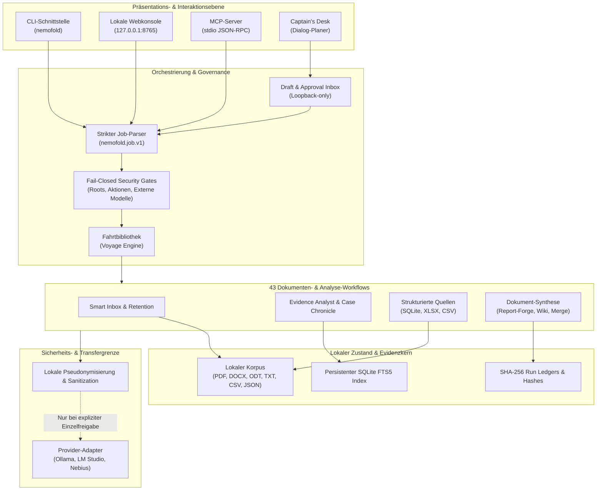
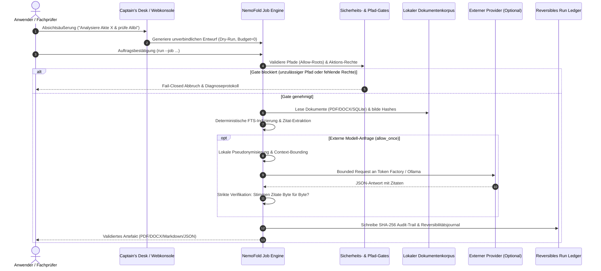
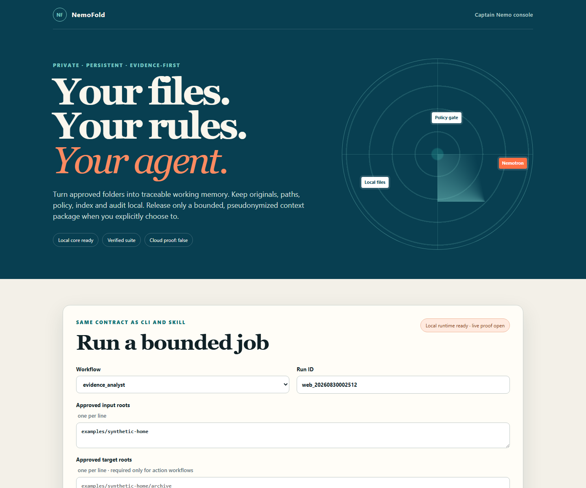

# NemoFold

[English](README.md) | Deutsch

[](pyproject.toml)
[](https://github.com/ellmos-ai/NemoFold/actions/workflows/ci.yml)
[](tests/)
[-blue.svg)](.github/workflows/ci.yml)
[%20%7C%20macos%20(mypy)-lightgrey.svg)](.github/workflows/ci.yml)
[](SECURITY.md)
[](SECURITY.md)
[](SECURITY.md)
[](LICENSE)
[](THIRD_PARTY_LICENSES.md)
[](https://github.com/ellmos-ai)
[](https://github.com/open-bricks)
[](llms.txt)

> **Aus Dokumenten werden Daten. NemoFold macht Wissen nutzbar.**
> *Private, evidenzorientierte Dokumenten-Intelligenz — 43 Workflows, Fail-Closed Security, lokale Invarianten & Zero-Egress.*

---

<a id="1-overview--core-mission"></a><a id="1-uebersicht--kernmission"></a>
<a id="overview--core-mission"></a><a id="uebersicht--kernmission"></a>
## 1. Übersicht & Kernmission

NemoFold ist ein privater, lokaler Dokumenten- und Evidenz-Agent. Er verwandelt freigegebene Dateiordner auf dem eigenen System in ein dauerhaftes, durchsuchbares Arbeitsgedächtnis — ohne Datenabfluss, ohne stilles Cloud-Tracking und ohne unkontrollierte Dateimodifikationen. Alle Behauptungen und Analyseergebnisse bleiben bis auf die exakte Textzeile im Ursprungsdokument nachvollziehbar; sämtliche Dateiaktionen sind transaktional protokolliert und vollständig reversibel.

Leitsatz: **Your files. Your rules. Your agent.**

Dieses Repository enthält die neue Wettbewerbsimplementierung für den Nebius x NVIDIA
Global AI Hackathon. Der lokale Kern ist bewusst ohne Cloud-Konto nutzbar. Die
Nemotron-auf-Nebius-Integration ist durch einen echten, bereinigten Token-Factory-Lauf
belegt, dessen vollständige Belegkette unter `examples/proven-run/` eingecheckt ist und
offline nachgeprüft werden kann (siehe „Der belegte Lauf" unten).

Die Dokument-Workflows sind Kompositionen aus vier geteilten Bausteinen: schemagebundene
Feldextraktion, Deduplikation, die das Gestrichene behält, abschnittsweise
Zusammenführung mit sichtbaren Konflikten und ein Delta gegen einen benannten
Snapshot. Weil diese Bausteine geteilt sind statt in einem Workflow eingeschlossen,
lassen sie sich auch für Fälle verketten, für die noch niemand einen Workflow
geschrieben hat.

Es passt sich Ihren Usecases auf zwei ehrliche Arten an: Das Captain's Desk plant aus
einem einfachen Satz neue Kombinationen vorhandener Bausteine, und jede vorbereitete
Fahrt wird zu einem wiederverwendbaren Entwurf. Das ist die ganze Lerngeschichte — eine
wachsende Bibliothek von Fahrten, kein Modell, das auf Ihren Dateien trainiert. Es wird
nichts feinjustiert, und nichts aus Ihren Dokumenten verlässt den Rechner ohne Ihre
Freigabe für genau diesen Transfer.

Derselbe Kern trägt beide Enden: Alltagsarbeit auf dem Laptop mit einem kleinen lokalen
Modell und eine Datenanalystin, die Nemotron über die Nebius Token Factory auf einen
großen Korpus richtet. Der Evidenzvertrag ändert sich dabei nicht — nur der Arbeiter.

### Schnellnavigation (18 Abschnitte)

| # | Abschnitt | Fokus |
|---|:---|:---|
| 1 | [Übersicht & Kernmission](#1-uebersicht--kernmission) | Mission, Werte & Zero-Egress Garantie |
| 2 | [Visuelle Architektur & Duale Diagramme](#2-visuelle-architektur--duale-diagramme) | Systemtopologie & Evidenz-Lebenszyklus |
| 3 | [Zielgruppen & Auffindbarkeit](#3-zielgruppen--auffindbarkeit) | Anwenderprofile [PERSONA-01] bis [PERSONA-04] |
| 4 | [Vergleichsmatrix gegenüber Alternativen](#4-vergleichsmatrix-gegenueber-alternativen) | 10 Dimensionen im Branchenvergleich |
| 5 | [Governance & Laufzeit-Invarianten](#5-governance--laufzeit-invarianten) | `INV-LOCAL-01` bis `INV-SLA-10` |
| 6 | [Implementierte Dokument-Workflows](#6-implementierte-dokument-workflows) | 43 verifizierte Workflows & Analyse-Kerne |
| 7 | [Installation & Schnellstart](#7-installation--schnellstart) | Setup, Virtual Environment & CLI |
| 8 | [Offline-Nachweis & Verifikation](#8-offline-nachweis--verifikation) | Lokale Demo & Fail-Closed Validierung |
| 9 | [Ausführung realer lokaler Aufträge](#9-ausfuehrung-realer-lokaler-auftraege) | Preview, Run, Ledger & Reversibilität |
| 10 | [Provider-Adapter, MCP & API](#10-provider-adapter-mcp--api) | Ollama, LM Studio, Claude/Codex & MCP |
| 11 | [Belegter Nebius Token Factory Lauf](#11-belegter-nebius-token-factory-lauf) | Nemotron 3 Super Audit & Replay-Receipts |
| 12 | [Fahrtbibliothek & Captain's Desk](#12-fahrtbibliothek--captains-desk) | Wiederverwendbare Pläne & Dialogführung |
| 13 | [Fallchronik-Tiefenanalyse](#13-fallchronik-tiefenanalyse) | Entitäten, Timelines, Alibi Weave & Kontradiktionen |
| 14 | [Strukturierte Quellen & Kontrollierte Ausgabe](#14-strukturierte-quellen--kontrollierte-ausgabe) | SQLite, XLSX, CSV, Web-Search & D-035 Versand |
| 15 | [Prüfen, Vergleichen & Komponieren](#15-pruefen-vergleichen--komponieren) | Reference Check, Rater Race, Guide & Report-Forge |
| 16 | [Lokale Webkonsole & Routen](#16-lokale-webkonsole--routen) | Web-Interface, REST-API & Governance-Tab |
| 17 | [Geschwister-Ökosystem & Integration](#17-geschwister-oekosystem--integration) | 16 Partner-Tools in `ellmos-ai` & `open-bricks` |
| 18 | [Transparenz, Lizenzen & Sicherheitsrichtlinie](#18-transparenz-lizenzen--sicherheitsrichtlinie) | Trust Boundary, Audit, SLA & § 521 BGB |

---

<a id="2-visual-architecture--dual-diagrams"></a><a id="2-visuelle-architektur--duale-diagramme"></a>
<a id="visual-architecture--dual-diagrams"></a><a id="visuelle-architektur--duale-diagramme"></a>
## 2. Visuelle Architektur & Duale Diagramme

### System-Topologie (5-Ebenen-Architektur)



### Evidenz-Lebenszyklus (Captain's Desk bis Artefakt)



---

<a id="3-target-personas--discoverability"></a><a id="3-zielgruppen--auffindbarkeit"></a>
<a id="target-personas--discoverability"></a><a id="zielgruppen--auffindbarkeit"></a>
## 3. Zielgruppen & Auffindbarkeit

NemoFold löst konkrete Herausforderungen von vier Hauptzielgruppen:

### [PERSONA-01] Datenschutz- und Compliance-Offiziere (DPO / CISO)
* **Problem:** Cloud-KI-Dienste gefährden Geschäftsgeheimnisse und verletzen DSGVO/GDPR durch unkontrollierten Datenabfluss.
* **Lösung:** NemoFold operiert standardmäßig zu 100 % lokal (Zero-Egress), verweigert unbefugte Netzwerkzugriffe (Fail-Closed) und belegt jeden Verarbeitungsschritt über unveränderliche SHA-256-Ledger.

### [PERSONA-02] Rechtsberater, Auditoren & Ermittler
* **Problem:** LLMs neigen zu Halluzinationen und erfinden Quellen oder Querverweise, die vor Gericht oder im Audit wertlos sind.
* **Lösung:** *Evidenz vor Inferenz.* Jede Aussage wird mit exakter Quellzeile und Byte-Verifikation belegt. Case Chronicle rekonstruiert Beziehungsnetzwerke und Alibi-Geflechte ohne unzulässige spekulative Schlüsse.

### [PERSONA-03] Enterprise Knowledge Manager & Archivare
* **Problem:** Tausende heterogene Dokumente (PDF, DOCX, ODT, Tabellen, E-Mails) liegen unstrukturiert und unauffindbar in Netzlaufwerken.
* **Lösung:** Automatische Smart-Inbox-Regeln, reversible Sortierung, Bestands-Snapshots (Continuous Folder Digest) und strukturierte Tabellenextraktion (Document Registry).

### [PERSONA-04] Technische Solo-Entwickler & Power-User
* **Problem:** Komplexe Agentic-Systeme erfordern oft schwere Cloud-Infrastruktur, Docker-Cluster oder undurchsichtige Abo-Modelle.
* **Lösung:** Schlankes Python-Paket (Standard-Bibliothek + minimale permissive Abhängigkeiten), per CLI, Webkonsole oder MCP direkt auf Desktop/Laptop nutzbar.

#### Typische Suchanfragen (Search Queries)
- `local first document analysis AI` · `private evidence based document agent`
- `offline PDF document intelligence open source` · `zero egress legal document timeline analysis`
- `reversible file organizer audit trail` · `deterministic inter rater reliability cohen kappa document tool`
- `DSGVO konforme Dokumentenanalyse lokal` · `privater Dokumenten AI Agent ohne Cloud Zwang`

---

<a id="4-comparative-matrix-vs-alternatives"></a><a id="4-vergleichsmatrix-gegenueber-alternativen"></a>
<a id="comparative-matrix-vs-alternatives"></a><a id="vergleichsmatrix-gegenueber-alternativen"></a>
## 4. Vergleichsmatrix gegenüber Alternativen

| Vergleichsdimension | Kommerzielle Cloud-RAGs | Lokale Chat-GUIs (OpenWebUI) | Dokumenten-Vektordatenbanken | NemoFold (v0.2.0) |
|:---|:---:|:---:|:---:|:---:|
| **Datenschutz & Egress (`INV-LOCAL-01`)** | Cloud-Zwang, Telemetrie | Lokal möglich, aber kein Gate | Nur Speicher, keine Gates | **100 % Local-First, Zero-Egress standardmäßig** |
| **Evidenz-Garantie (`INV-EVID-02`)** | Vage Quellenangaben | Freie LLM-Halluzination | Abstandsmetrik (Kosinus) | **Bytegenaue Zitat-Prüfung (`INV-EVID-02`)** |
| **Reversibilität (`INV-REV-03`)** | Keine Dateiverwaltung | Keine Dateimodifikation | Keine Dateioperationen | **Transaktionales Journal mit 100 % Undo** |
| **Fail-Closed Gates (`INV-GATE-04`)** | Best-Effort | Keine Zugriffsbeschränkung | API-Token-Prüfung | **Strikte Allow-Roots & Budget-Gates** |
| **Deterministische Metriken (`INV-DET-05`)** | Nicht vorhanden | Variabel / probabilistisch | Variabel | **SVG-Hashes & Cohens Kappa (`INV-DET-05`)** |
| **Transparente Belege (`INV-PROOF-06`)** | Black Box | Keine Audit-Ledgers | Rohvektoren | **Kryptografische SHA-256 Run Ledgers** |
| **Keine Privilegienerhöhung (`INV-PRIV-07`)** | Root/Service-Accounts | Benutzerabhängig | Server-Dienst | **Striktes `RunAsInvoker`, keine Elevation** |
| **Offene Lizenzen (`INV-LIC-08`)** | Proprietär | Unterschiedlich | Teilweise Open Core | **100 % MIT / BSD Permissiv (`INV-LIC-08`)** |
| **Workflows & Werkzeuge** | 1–3 generische Chats | 1 Chat-Interface | Keine Workflows | **43 integrierte Dokument-Workflows** |
| **Sicherheits-SLA (`INV-SLA-10`)** | Undokumentiert | Community-best-effort | Kommerziell gestaffelt | **48h Antwort / 5 Tage Triage (`INV-SLA-10`)** |

---

<a id="5-governance--runtime-invariants"></a><a id="5-governance--laufzeit-invarianten"></a>
<a id="governance--runtime-invariants"></a><a id="governance--laufzeit-invarianten"></a>
## 5. Governance & Laufzeit-Invarianten

Das Design von NemoFold basiert auf zehn unverletzlichen System-Invarianten:

- **`INV-LOCAL-01` (Zero-Egress-Default):** Sämtliche Parsing-, Indexierungs- und Analyseoperationen verbleiben standardmäßig auf dem lokalen Rechner.
- **`INV-EVID-02` (Evidenz vor Inferenz):** Jede Behauptung eines Modells muss sich durch ein wortwörtliches Zitat im Eingabekontext verifizieren lassen.
- **`INV-REV-03` (Vollständige Reversibilität):** Dateioperationen (Verschieben, Umbenennen, Bereinigen) werden in einem Transaktionsjournal protokolliert und lassen sich mit `nemofold undo` verlustfrei zurücksetzen.
- **`INV-GATE-04` (Fail-Closed Sicherheit):** Unzulässige Pfade, fehlende Berechtigungen oder unbestätigte externe Transfers führen zum sofortigen, sicheren Abbruch.
- **`INV-DET-05` (Deterministische Synthese):** Gleiche Quelldaten erzeugen identische SVG-Visualisierungen, Verzeichnisberichte und Metriken.
- **`INV-PROOF-06` (Unveränderliche Audit-Ledger):** Jeder Ausführungsschritt schreibt ein kryptografisch gehashtes JSON-Ledger für Auditierbarkeit.
- **`INV-PRIV-07` (Privilegien-Minimierung):** NemoFold erfordert keine Administrator- oder Root-Rechte und läuft strikt als Standardbenutzer (`RunAsInvoker`).
- **`INV-LIC-08` (Permissive Lizenz-Hygiene):** Keine Copyleft-Abhängigkeiten (GPL/AGPL). Vollständige Transparenz in `THIRD_PARTY_LICENSES.md`.
- **`INV-PARK-09` (Zweisprachige Parität):** Dokumentation und Governance existieren gleichwertig auf Deutsch und Englisch.
- **`INV-SLA-10` (Verbindliche Sicherheits-Reaktionszeit):** Bestätigung von Schwachstellenmeldungen binnen 48 Stunden, Triage binnen 5 Tagen gemäß `SECURITY.md`.

---

<a id="6-implemented-document-workflows"></a><a id="6-implementierte-dokument-workflows"></a>
<a id="implemented-document-workflows"></a><a id="implementierte-dokument-workflows"></a>
<a id="was-implementiert-ist"></a>
## 6. Implementierte Dokument-Workflows

`SUPPORTED_WORKFLOWS` registriert 43 Jobverträge. Die gründenden sechzehn stehen
unten; die Fallchronik-Tiefenanalyse ergänzt sieben weitere
([Abschnitt 13](#13-fallchronik-tiefenanalyse)), das Prüf-/Vergleichs-/Komponier-Set
sieben ([Abschnitt 15](#15-pruefen-vergleichen--komponieren)), und dreizehn weitere
gate-geprüfte Struktur-, Web- und Spezial-Workflows stehen in der zweiten Tabelle
weiter unten (16 + 7 + 7 + 13 = 43).

| Workflow | Lokales Ergebnis |
|---|---|
| Smart Inbox | Dateiendungsbasierter Ablageplan, Alles-oder-nichts-Kollisionsgate, protokollierte Verschiebungen, Fortsetzen und Rückgängig |
| Naming, Format & Retention | Regelauflösung, Namens- und Aufbewahrungsprüfungen, Dry-Run, reversible Verschiebe-/Kopiervorgänge sowie Konvertierungskopien für TXT/MD/RST |
| Cleanup Rules | Manuelle Massenablage plus lesbare Vorschläge, die nur aus expliziten Korrekturen entstehen und sich nie selbst aktivieren |
| Mail-to-Case | Schreibgeschützte lokale EML-Aufnahme, quellengebundenes Falldossier, Manifest und gehashte Anlagenextraktion |
| Controlled Email | Lokaler RFC-822-Entwurf und exakter Freigabe-Hash; Versandwünsche blockieren ohne unmittelbare Bestätigung und belegten Serveradapter |
| Universal Bundle | Deterministisches Textbündel, Manifest, ZIP, Hashes und explizite Einträge für nicht unterstützte oder unlesbare Dateien |
| Continuous Folder Digest | Dauerhafte Bestands-Snapshots mit neuen, geänderten, unveränderten und gelöschten Quell-IDs |
| Evidence Analyst | Persistenter SQLite-FTS-Index, mehrere Fragen, exakte Zitate, Quellenkatalog, Zeilen-/Seitenfundstellen, Abdeckung und Berichte |
| Version Resolver | Auflösung je Dateifamilie, explizite Priorität für Gültigkeit/Datum/Version, benannter Dateizeit-Fallback und Zeilenvergleich |
| Contact Monitor | Quellenzitierte Kontakt- und Zuständigkeitskandidaten, Vergleich benannter Snapshots und keine automatische Löschung |
| Report & Artifact Studio | Validierter Analysevertrag, ausgegeben als Markdown, TXT, PDF, DOCX und ODT |
| Document Registry | Deklarierte Spalten aus jedem freigegebenen Dokument in einer Tabelle; jede gefüllte Zelle behält Quelle und Zeile, eine unbeantwortete Zelle bleibt leer, Ausgabe als JSON, CSV und vollständige Berichtsfamilie |
| Fact Distill | Zitierfähige Sätze je Quelle; wiederholte Aussagen werden aus den Befunden gestrichen, jede gestrichene Fundstelle bleibt in einem eigenen Anhang sichtbar |
| Synopsis Merge | Abschnittsweise Zusammenführung mehrerer Dokumente mit Quellanker je Absatz; abweichende Labels erscheinen als Konfliktblöcke statt als stille Entscheidung |
| Daily Arrivals | Vergleich gegen einen benannten Snapshot mit Name, Größe, Zeit und Kurzinhalt je neuer Datei, Eigentümer wo die Plattform ihn nennen kann, plus selbst zu installierende Aufgabendatei |
| NemoClaw Platform & Proof | Pfadfreie, gehashte Auftragspakete mit Fail-closed-Adapter für die Nebius Token Factory und unabhängig prüfbarem Ergebnisbeleg; belegt durch einen echten Token-Factory-Lauf, eingecheckt unter `examples/proven-run/` |

### Gate-geprüfte Struktur-, Web- & Spezial-Workflows

Dreizehn weitere Workflows entstanden gegen die Ellmos-Usecase-Abnahmegates
(`G05`–`G14`, siehe [Abschnitt 8](#8-offline-nachweis--verifikation)) und
strukturierte/Web-Quellen ([Abschnitt 14](#14-strukturierte-quellen--kontrollierte-ausgabe));
keiner davon hatte vor diesem Durchgang eine Tabellenzeile.

| Workflow | Lokales Ergebnis |
|---|---|
| Cost Timeline (`cost_timeline`, G05) | Wiederkehrende und unregelmäßige Kosten aus erklärten Vertragsfeldern geplant; ein Betrag, den die Quellen offenlassen, bleibt unbestimmt |
| Subscription Reconcile (`subscription_reconcile`, G06) | Deterministischer Abgleich zwischen erklärten Abonnements und beobachteten Nachrichten-/Rechnungsbelegen; Preis- oder Statusabweichungen und mehrdeutige Treffer blockieren statt zu raten |
| Medication Reconcile (`medication_reconcile`, G07) | Deterministische Konsolidierung von Medikationsplänen über Arztbriefe und Entlassbriefe hinweg; widersprüchliche Dosierungen oder Zeitpläne stoppen zur Bestätigung statt automatisch entschieden zu werden |
| Database Reader (`database_reader`, G08) | Strikt schreibgeschützter Zugriff auf eine erklärte Spezialisten-SQLite-Datenbank unter einer Schema-Allowlist; Änderungsversuche werden abgelehnt |
| Knowledge Composer (`knowledge_composer`, G09) | Belegte Dokumente (z. B. ein ASCII-Lebenslauf, ein Unterstützungsarbeitsblatt) aus lokalen Wissensquellen generiert; erzeugte Struktur bleibt von der Quellevidenz getrennt |
| Routine Query (`routine_query`, G10) | Schreibgeschützte Turnusprüfung gegen eine lokale Routinen-/Erinnerungsdatenbank; meldet das nächste Fälligkeitsdatum und sagt ausdrücklich, dass kein Hintergrund-Scheduler installiert ist |
| OCR Pipeline (`ocr_pipeline`, G11) | Scan-Seiten-Erkennung, seitenweise OCR-Qualitätsprüfung, deterministische Duplikat-/Delta-Indizierung; hält bei Qualität unter dem Schwellenwert zur Prüfung an |
| Document QA (`document_qa`, G13) | Prüfung fertiger Dokumente (Formatintegrität, Vollständigkeit, nicht ersetzte Vorlagenplatzhalter, SHA-256-Erhalt) und versiegelte Publikationspakete |
| Dossier (`dossier`, G14) | Eine zitierte Leseliste zu einem erklärten Thema, zusammengestellt aus gate-geprüften Websuchergebnissen; nennt sich selbst Leseliste, keinen Befund |
| Briefing (`briefing`, G14) | Zitierte Webfunde zu einem erklärten Thema, strukturiert in Fakten, Schlussfolgerungen und offene Unsicherheiten; ein dünner Quellenbestand ergibt ein begrenztes Briefing statt falscher Vollständigkeit |
| Web Research (`web_research`) | Gate-geprüfte Websuche hinter Serverfreigabe, Einzelfreigabe, Adapter-Bereitschaft und Pseudonymisierungs-Preflight; behält nur Ergebnisse mit Quelladresse |
| Bundle Completeness Check (`bundle_completeness_check`) | Meldet allein aus der Abdeckung, ob jede freigegebene Quelle gelesen und jeder Pflichtteil erzeugt wurde, ohne den Inhalt zu bewerten |
| Print Action (`print_action`) | Übergibt eine benannte Datei an das betriebssystemseitig registrierte Druckprogramm und hält fest, dass das Drucken selbst Ihr Schritt ist, nicht der Lauf |

Die gemeinsamen Kerne sind Laufzeit, Policy-/Privacy-Gate, Laufjournal und
Wiederherstellung, Evidenz-Engine, providerneutraler Adapterkern, MCP-Oberfläche und
Artefaktexport. Die lokale Extraktion unterstützt Textdateien, JSON, CSV, HTML, PDF,
DOCX und ODT. Nicht unterstützte oder unlesbare Dateien bleiben als sichtbare
Abdeckungslücken erhalten.

Cloud-Kosten, Uploads, echte NemoClaw-/Nebius-Ausführung und weitere Änderungen an
Devpost bleiben getrennte menschliche Freigabegates.



<a id="7-installation--quick-start"></a><a id="7-installation--schnellstart"></a>
<a id="installation--quick-start"></a><a id="installation--schnellstart"></a>
<a id="install"></a>
## 7. Installation & Schnellstart

```powershell
python -m venv .venv
.venv\Scripts\python -m pip install -e ".[dev]"
.venv\Scripts\python -m nemofold --help
```

Jeder Nicht-Demo-Befehl verwendet denselben strikten JSON-Vertrag
`nemofold.job.v1`. Siehe
[`schemas/nemofold-job-v1.schema.json`](schemas/nemofold-job-v1.schema.json) und
das Verzeichnis [`examples/jobs`](examples/jobs).

<a id="8-offline-proof--verification"></a><a id="8-offline-nachweis--verifikation"></a>
<a id="offline-proof--verification"></a><a id="offline-nachweis--verifikation"></a>
<a id="offline-proof"></a>
## 8. Offline-Nachweis & Verifikation

```powershell
$env:PYTHONPATH = "$PWD\src"
python -m nemofold demo --input examples\synthetic-home --output run-reports\demo
```

Der Bericht weist bewusst `cloud_proof: false` aus. So lässt sich der
Fail-closed-Pfad ausführen:

```powershell
python -m nemofold demo --input examples\synthetic-home --output run-reports\blocked `
  --scenario blocked-external
```

Die normale Demo erzeugt ein Text-/Manifest-/ZIP-Bündel, einen Ordner-Digest,
Kontextbelege, einen SQLite-FTS-Index, Markdown-/TXT-/PDF-/DOCX-/ODT-Berichte und ein
Laufjournal. Sie verschiebt eine synthetische Inbox-Datei und macht den Vorgang wieder
rückgängig, um die Reversibilität zu belegen.

### Abnahmegate-Register

16 von 18 internen Ellmos-Usecase-Abnahmegates (`G01`–`G18`) tragen im ausgelieferten
Register den Status `done`, jedes belegt durch committete, neu hashbare Evidenz: 444
Dateien (1,8 MB) unter `examples/acceptance-evidence/`, 476 vom folgenden Befehl
geprüfte Dateien. `G17` und `G18` bleiben `not_supported`, mit ihren Abgrenzungsgründen
im Register selbst festgehalten.

```powershell
nemofold acceptance-gates --evidence-root .
```

Ohne `--evidence-root` scheitert der Befehl bewusst fail-closed mit Exit-Code 2
(`done_gate_requires_evidence_root:G01`): Ein `done`-Anspruch ist ohne die Dateien
dahinter nicht lesbar, also verweigert der Befehl einen Status zu melden, den er nicht
prüfen kann, statt dem Registertext zu vertrauen. Nach einer Bundle- oder
Vertragsänderung wird die Evidenz neu erzeugt mit:

```powershell
nemofold acceptance-evidence --work-dir <dir>
```

Das führt alle 16 Gate-Bundles erneut aus, exportiert nur die Dateien, die der
jeweilige Receipt referenziert (Hostpfade durch das Token `<evidence-root>` ersetzt,
Hashes über die exportierten Bytes neu berechnet), und schreibt das Register neu; ein
Gate, dessen Bundle keinen prüfbaren Receipt mehr liefert, verliert `done` statt einen
veralteten Anspruch zu behalten.

<a id="9-executing-real-local-jobs"></a><a id="9-ausfuehrung-realer-lokaler-auftraege"></a>
<a id="executing-real-local-jobs"></a><a id="ausfuehrung-realer-lokaler-auftraege"></a>
<a id="run-a-real-local-job"></a>
## 9. Ausführung realer lokaler Aufträge

```powershell
$runId = "local_analysis_1"
python -m nemofold preview --job examples\jobs\evidence-local.json `
  --allow-root $PWD --run-id $runId
python -m nemofold run --job examples\jobs\evidence-local.json `
  --allow-root $PWD --run-id $runId
python -m nemofold verify run-reports\evidence-local\ledger\$runId.json
```

`preview` ruft kein externes Modell auf und führt keine Dateiaktionen aus. Bei einem
Auftrag mit externem Modell schreibt es das genaue pseudonymisierte Kontextpaket, das
den Rechner verlassen dürfte, und protokolliert `transfer_performed: false`. Ein
späteres `run` blockiert weiterhin, solange kein echter externer Laufzeitadapter und
keine ausdrücklichen Datenschutz-, Modell- und Kostengates vorhanden sind.

`nemofold package` verwandelt einen `allow_once`-Auftrag in ein gehashtes, pfadfreies
lokales NemoClaw-Verzeichnis und validiert es sofort. Es führt weiterhin keinen Upload
aus und protokolliert `transfer_performed: false`; siehe
[NemoClaw-Integration](docs/nemoclaw-integration.md).

<a id="10-provider-adapters-mcp--api"></a><a id="10-provider-adapter-mcp--api"></a>
<a id="provider-adapters-mcp--api"></a><a id="provider-adapter-mcp--api"></a>
<a id="use-any-supported-model-through-one-evidence-core"></a>
## 10. Provider-Adapter, MCP & API

NemoFold kann ausschließlich den lokal ausgewählten und pseudonymisierten
Evidenzkontext an Ollama, LM Studio, eine persönliche Codex-/Claude-Code-CLI oder die
offiziellen OpenAI-/Anthropic-APIs übergeben. Aussagen werden nur angenommen, wenn
jedes Zitat im ausgehenden Kontext der zugehörigen Frage vorkommt. Die Providerwahl ist
Laufzeitkonfiguration und verändert den strikten Auftragsvertrag nicht.

```powershell
python -m nemofold providers
python -m nemofold analyze-provider --job examples\jobs\evidence-local.json `
  --allow-root $PWD --run-id ollama_1 --provider ollama --model qwen3
```

Derselbe Dienst ist über `POST /api/provider-analyze` und den stdio-MCP-Server
verfügbar:

```powershell
codex mcp add nemofold -- python -m nemofold mcp --base-dir $PWD --allow-root $PWD
claude mcp add --scope user nemofold -- python -m nemofold mcp `
  --base-dir $PWD --allow-root $PWD
```

Lokale Provider sind auf Loopback beschränkt. Externe Adapter verlangen `allow_once`,
ein serverseitiges Gate für externe Modelle und eine Freigabe je Übertragung. Schlüssel
werden nur aus Umgebungsvariablen gelesen. Generische Providerbelege werden niemals
zum Nebius-Wettbewerbsnachweis; dafür bleibt ausschließlich der nächste Abschnitt
zuständig. Siehe [Provideradapter, lokale API und MCP](docs/providers-and-mcp.md).

<a id="11-approved-nebius-token-factory-run"></a><a id="11-belegter-nebius-token-factory-lauf"></a>
<a id="approved-nebius-token-factory-run"></a><a id="belegter-nebius-token-factory-lauf"></a>
## 11. Belegter Nebius Token Factory Lauf

### Modellwahl und Beitrag der Token Factory

Das konfigurierte Modell ist NVIDIA Nemotron 3 Super
(`nvidia/nemotron-3-super-120b-a12b`), bereitgestellt über die
[Nebius Token Factory](https://nebius.com/services/token-factory/nemotron). Die Wahl
ist bewusst: Die Gewichte sind unter der NVIDIA Open License vollständig offen (der
Hackathon verlangt ein offenes NVIDIA-Modell); das Agentic-Reasoning- und
Instruction-Following-Profil passt zu NemoFolds striktem, JSON-gebundenem
Evidenzvertrag; das lange Kontextfenster trägt ein komplettes begrenztes
Evidenzpaket in einer Anfrage; und das hybride MoE-Design (rund 12B aktive von 120B
Parametern) hält die konservative Kostenobergrenze pro Aufruf weit unter dem
Job-Budget. Der Adapter erzwingt das Präfix `nvidia/nemotron-` doppelt — im
Preflight und erneut vor dem Transport.

Die Token Factory steuert den einen Schritt bei, den das Produkt lokal nicht leisten
kann: einen starken gehosteten Reasoning-Durchgang über das vorbereitete
Evidenzbündel. Alles andere — Originale, Pfade, Index, Richtlinien, Journal und
Verifikation — bleibt auf dem lokalen Rechner; nur pseudonymisierte begrenzte Chunks
passieren das Gate, und das bereinigte Ergebnis wird in die lokal verifizierte
Belegkette zurückgebunden. Ein echter bezahlter Lauf ist ein ausdrückliches
Nutzer-Gate; es wurde einmal erteilt, und der entstandene Beleg ist unten eingecheckt.

### Der belegte Lauf (2026-09-02)

Ein echter bezahlter Token-Factory-Lauf über das fiktive synthetische Aktenkorpus
schloss mit `status: executed` und `cloud_proof: true` ab. Das Modell beantwortete
zwei Evidenzfragen (der blaue VW Golf, das bestätigte Alibi); jede Aussage trägt
exakte Zitate, die der lokale Verifier Byte für Byte gegen die pseudonymisierten
Chunks abgeglichen hat. Verbrauch: 4550 Prompt- + 3657 Completion- = 8207 Tokens,
Kosten 0,0047 USD gegen eine Obergrenze von 1,00 USD.

Das vollständige Paket — Job, Manifest, Privacy-Receipt, Context-Receipts,
Transferversuch und Ergebnis — liegt unter `examples/proven-run/`, ohne Geheimnisse
und ohne echte personenbezogene Daten (das Korpus ist das fiktive
`examples/synthetic-case/`). Juroren können es offline und ohne Konto nachprüfen:

```bash
python -m nemofold verify-result examples/proven-run
```

Ehrlichkeitsnotiz: Es brauchte fünf Anläufe, und genau das ist der Punkt. Die ersten
vier schlossen fail-closed bei nahezu null Kosten — ein Wire-Format-400 des
Endpunkts, der lokale Verifier fing zwei falsch zugeordnete Zitate in einer sonst
perfekt aussehenden Antwort, eine überstrenge eigene Receipt-Regel und ein
Provider-Usage-Echo mit zusätzlichen Detailfeldern. Jede Ablehnung ist ein Bugfix in
dieser Historie — und dass der Verifier eine flüssige Modellantwort wegen
Zitat-Zuordnung zurückwies, ist das Kernversprechen des Produkts (Evidenz vor
Inferenz) im Betrieb gegen ein echtes Frontier-Modell, kein Slogan.

Der Live-Adapter ist ein getrenntes Gate für einen irreversiblen Datentransfer. Er
akzeptiert nur den offiziellen HTTPS-Ursprung der Nebius Token Factory, lehnt
Weiterleitungen ab, prüft vor der Anfrage eine konservative Kostengrenze, liest den
Schlüssel ausschließlich aus `NEBIUS_API_KEY` und verweigert die Wiederholung eines
Pakets, das bereits `result.json` oder einen dauerhaften Übertragungsversuch enthält.
Nach dem Kostengate und vor jedem Beleg bestätigt er die exakte Modell-ID gegen den
Live-Katalog `/v1/models`. Dieser Aufruf ist ein autorisierter Metadatenabruf ohne
Auftragsinhalt; eine zurückgezogene oder vertippte Modell-ID bricht deshalb ohne Beleg
ab und lässt das Paket vollständig lauffähig. Ein bestätigter Katalog schreibt
`model_catalog_checked: true` ins Ergebnis, und der Verifizierer weist ein Ergebnis
zurück, das etwas anderes behauptet.

```powershell
$env:NEBIUS_API_KEY = "<session-only-key>"
python -m nemofold token-factory-preflight <package-directory> `
  --input-price-usd-per-million <current-input-rate> `
  --output-price-usd-per-million <current-output-rate> `
  --max-completion-tokens 8192
python -m nemofold token-factory-run <package-directory> `
  --approve-live-transfer `
  --input-price-usd-per-million <current-input-rate> `
  --output-price-usd-per-million <current-output-rate> `
  --max-completion-tokens 8192 `
  --declared-nemoclaw-version <captured-installed-version>
python -m nemofold verify-result <package-directory>
Remove-Item Env:\NEBIUS_API_KEY
```

Die beiden Preise sind Pflichtangaben, weil sich Preise ändern können. Sie müssen zum
Ausführungszeitpunkt aus der aktuellen Preisliste des Anbieters übernommen werden. Die
Reasoning-Modelle verbrauchen vor der JSON-Antwort Completion-Tokens für das Denken;
`--max-completion-tokens` deshalb großzügig wählen — das konservative Kostengate prüft
die resultierende Obergrenze weiterhin vor jeder Anfrage gegen das Job-Budget. Die
bereinigte `result.json` bindet die genaue Anfrage, die bereinigte Antwort
(`response_sha256` wird über den bereinigten Antwortkörper berechnet, nie über rohe
Anbieter-Bytes), Nutzung, Preisangaben, Kosten, Endpunkt, Modell, Zeitstempel und
Modellausgabe an das unveränderliche lokale Paket. Sie enthält weder Authorization-Header noch API-Schlüssel. Eine fehlgeschlagene
Anbieterantwort protokolliert `transfer_performed: true`, aber niemals
`cloud_proof: true`. Bricht die Verbindung ohne Antwort ab, bleibt die vor der Anfrage
geschriebene `transfer-attempt.json` erhalten, meldet einen unklaren Übertragungsstand
und blockiert eine unsichere automatische Wiederholung. Die Wiederaufnahme nach einem
verbrauchten Versuch ist bewusst, nicht destruktiv: Mit `nemofold package` ein frisches
unveränderliches Paket unter neuer `run_id` bauen und dieses ausführen. Vorhandene
Belege werden nie gelöscht — der gescheiterte Versuch bleibt prüfbar, das neue Paket
lauffähig.

`token-factory-preflight` führt keine Netzwerkanfrage aus und schreibt keinen
Übertragungsbeleg. Es validiert das unveränderliche Paket, den Endpunkt, das explizite
Nemotron-Modell, die JSON-Anfrage, die vom Aufrufer gelieferten aktuellen Preise, die
konservativen Maximalkosten, das Auftragsbudget, die Schutzregeln gegen Doppelläufe und
das Vorhandensein eines Sitzungsschlüssels. Seine Ausgabe hält `network_called`,
`transfer_performed` und `cloud_proof` stets auf false; ein erfolgreicher Preflight ist
Bereitschaft, kein Ausführungsnachweis und keine Transferfreigabe. Er meldet deshalb
`model_catalog_checked: false`: Den Katalog bestätigt `token-factory-run` als einziger
Befehl, der das Netz berühren darf.

Die Anfrage nutzt den dokumentierten `json_object`-Antwortmodus der Token Factory und
überträgt ausschließlich dokumentierte Chat-Completion-Parameter, denn ein einziges
undokumentiertes Feld, das der Endpunkt ablehnt, würde den einen freigegebenen Lauf für
einen HTTP 400 verbrauchen. NemoFold fügt sein vollständiges Ausgabeschema in die
begrenzte Nutzer-Nutzlast ein und validiert das zurückgegebene Objekt lokal. Damit hängt
der Evidenzvertrag nicht von modellspezifischer serverseitiger JSON-Schema-Erzwingung ab.

Die optional angegebene NemoClaw-Version ist nur Metadatum. Das Ergebnis protokolliert
`nemoclaw_proof: false`; nur ein separat erfasster, bereinigter Laufzeit-Log aus der
tatsächlichen Sandbox kann eine NemoClaw-Ausführung belegen. Die frühere Pre-Release-
Option `--nemoclaw-version` wurde bewusst entfernt, weil ihr Name einen Beleg
suggerierte; Skripte müssen stattdessen `--declared-nemoclaw-version` verwenden.

Aktionsaufträge verlangen zusätzlich `--approve-actions`. Ein abgeschlossener
Aktionslauf kann mit `nemofold undo <run-id> --output <dir> --allow-root <root>
--approve-actions` rückgängig gemacht werden. Fehlgeschlagene oder blockierte Aufträge
lassen sich mit `nemofold resume` unter Beibehaltung der ursprünglichen Auftragsidentität
und des Journals fortsetzen.

<a id="12-voyage-library--captains-desk"></a><a id="12-fahrtbibliothek--captains-desk"></a>
<a id="voyage-library--captains-desk"></a><a id="fahrtbibliothek--captains-desk"></a>
<a id="my-use-cases-the-voyages-library"></a><a id="meine-usecases-die-fahrten-bibliothek"></a>
## 12. Fahrtbibliothek & Captain's Desk

Ein Plan, den Sie behalten, bekommt einen Namen. Die Übersicht trägt die Bibliothek:
gespeicherte Fahrten neben fünf Spezialisten, die NemoFold mitbringt — Faktendestillat
als PDF, Themenbündel mit Belegen, Tagesbericht, Verzeichnistabelle und
Angebotssynopse. Ein Spezialist ist ein schreibgeschützter Ausgangspunkt: Er trägt
Workflows und Parameter, aber keinen Pfad. Eine mitgelieferte Datei kann deshalb nie
einen Ordner auf Ihrem Rechner benennen und nie von selbst laufen. Beim Kopieren wird
sie an Ihre freigegebenen Roots gebunden und ist danach ein gewöhnlicher, bearbeitbarer
Eintrag.

Bearbeiten geht auf zwei Wegen, und beide enden in etwas, das Sie bestätigen. In der
Detailansicht ordnen oder entfernen Sie Schritte von Hand und speichern. Oder Sie
fragen den Kapitän — „füge zwischen Schritt 2 und 3 einen Tagesbericht ein" — und
erhalten die Schrittliste vorher und nachher als Diff mit Übernehmen-Knopf. Geschrieben
wird die Bibliothek erst beim Übernehmen, und was das Desk nicht zuordnen kann, wird
beantwortet statt geraten: Anonymisierung etwa gehört zum Datenschutz-Gate jedes
Schritts und ist kein eigener Schritt.

Eine Fahrt auszuführen heißt: Schritte der Reihe nach, jeder durch dieselben Gates und
mit eigenem Ledger, und ein Gesamt-Dossier verlinkt sie. Ein blockierter Schritt stoppt
die Kette dort, damit nichts Nachgelagertes auf einem unfertigen Ergebnis läuft. Ging
es gut, sehen Sie eine ruhige Zeile und die Details einen Klick entfernt; ging es
schief, liegen Schritte, Gates und Modelle offen vor Ihnen.

Eine Modellpräferenz kann auf drei Ebenen stehen, und die spezifischste gewinnt: Glied,
Kette, lokaler Default. Eine Kette kann stattdessen erklären, dass sie ihre Glieder
überschreibt — gedacht für datenschutzkritische Arbeit, die lokal bleiben muss, was ein
Glied auch sagt. Eine solche Fahrt trägt in der Bibliothek ein Warnzeichen und die
Begründung, die ihr Besitzer hinterlegt hat. Für einen einzelnen Lauf lässt sich außerdem
ein Modell für die ganze Fahrt wählen: Der Override gilt einmalig, erscheint im Dossier
und lässt die gespeicherten Einstellungen unberührt.

Über allem steht eine Regel, die kein Modus, kein Override und keine Einstellung
aufheben kann: Eine als local-only erklärte Kette ist ein Deckel. Eine exponiertere
Einstellung darunter gewinnt nicht und verliert auch nicht still — sie stoppt die Kette
und fragt nach, denn still zu erweitern, wer Ihre Dokumente sieht, ist das eine
Versagen, das sich dieses Produkt nicht leisten kann. Auch für sich erteilt eine
Präferenz keine Erlaubnis: Externmodell-Gate, Freigabe je Lauf und Budget entscheiden
weiterhin.

Das Dossier nennt das tatsächlich gelaufene Modell — nicht immer das bevorzugte — und
sagt, welcher der drei Fälle vorlag. Die meisten Workflows arbeiten deterministisch und
haben überhaupt keinen Reasoning-Worker; eine Präferenz darauf bleibt gespeichert und
wird als nicht anwendbar ausgewiesen, statt ihr Arbeit zuzuschreiben, die sie nicht
geleistet hat. Ein lokaler Worker beim Evidence Analyst wird wirklich gefragt, denn ein
lokaler Endpunkt braucht keine Transferfreigabe je Lauf. Ein externer stoppt die Kette
und verweist darauf, diesen Schritt einzeln zu starten, denn ein Kettenlauf erteilt nie
eine Freigabe je Lauf.

Jeder Eintrag trägt Themen-Tags — so findet ein Usecase den Raum, in den er gehört —
und er kann einen Zeitplan tragen. Ein Zeitplan ist eine erklärte Absicht und nicht mehr:
Er hält fest, wann Sie die Fahrt laufen lassen wollen, ergänzt das abgeleitete Tag
`scheduled`, damit der Routinenfilter ihn findet, und sagt das in der gespeicherten Datei
über sich selbst. NemoFold registriert keine Aufgabe in Ihrem Betriebssystem und startet
nichts von allein.

Manche Usecases lassen sich noch nicht bedienen. Sie werden trotzdem aufbewahrt, mit dem
Instrument benannt, auf das sie warten, und getrennt von den lauffähigen gelistet — ein
festgehaltener Wunsch ist mehr wert als ein abgelehnter, solange ihn niemand für etwas
Lauffähiges hält.

<a id="ask-the-captains-desk"></a><a id="das-captains-desk-fragen"></a>
### Das Captain's Desk fragen

Die Übersicht der Konsole beginnt mit dem Captain's Desk: ein einfacher Satz hinein,
eine Kette vorbereiteter Auftragsentwürfe hinaus. Es plant und bereitet vor; es führt
nie aus, versendet nie und speichert keine Freigabe. Jeder vorbereitete Schritt bleibt
Dry-run, rein lokal und ohne Budget — unabhängig davon, was die Anfrage verlangt hat.

Auf `Unfall mit Hyundai und schreib mir eine mail an zuständigen versicherungsberater
füge bild ein als entwurf` bereitet das Desk den Contact Monitor vor — weil die Quellen
die zuständige Person bereits nennen könnten — und danach einen Controlled-Email-Entwurf,
dessen Betreff aus dem Satz stammt. Was es nicht weiß, fragt es: Empfänger, Absender und
welche freigegebene Datei angehängt werden soll, mit dem Hinweis, dass ein Anhang gehasht,
aber nie als Beleg zitiert wird.

Ebenso deutlich benennt das Desk seine Grenzen. Wer ein zweisprachiges Dokument
abgleichen will, erfährt, dass Bilingual Sync ein geplanter, kein aktiver Document
Service ist — und bekommt die ehrlichste heutige Annäherung vorbereitet: einen
Folder-Digest-Schnappschuss und einen Version-Resolver-Vergleich. Wer Wiederholung
verlangt, erhält die zwei wahrheitsgemäßen Wege: die vorbereiteten Entwürfe erneut
ausführen oder selbst eine Aufgabe im eigenen Betriebssystem einrichten, die die CLI
aufruft. NemoFold hat keinen eigenen Scheduler und startet sich nicht selbst — und
behauptet das folglich auch nicht.

Vorbereitete Fahrten landen in derselben Entwurfs-Inbox, in die auch CLI, MCP und die
lokale API schreiben, gekennzeichnet mit `source: wizard`. Ein Mensch öffnet jeden
Entwurf im Maschinenraum, ergänzt das Offene und führt ihn aus. Das Desk ist eine reine
Loopback-Fläche: in der öffentlichen Demo nicht vorhanden, auf einem netzexponierten
Server abgelehnt.

<a id="13-case-chronicle-deep-analysis"></a><a id="13-fallchronik-tiefenanalyse"></a>
<a id="case-chronicle-deep-analysis"></a><a id="fallchronik-tiefenanalyse"></a>
<a id="case-chronicle"></a><a id="fall-chronik"></a>
## 13. Fallchronik-Tiefenanalyse

Vier Analysekerne machen aus einem Ordner voller Aussagen, Berichte und Verträge
Strukturen, die sich bis zu einem Satz zurückverfolgen lassen: wer vorkommt, welche
Verbindungen tatsächlich dastehen, wann jemand verortet ist und wo ihn gar nichts
verortet. Sieben Workflows setzen darauf auf — Person Registry, Relation Model,
Person Timeline, Coverage Timeline, Alibi Weave, Contradiction Synopsis und Corpus
Query.

Keiner davon zieht einen rechtlichen Schluss, und jeder Bericht sagt das in seinen
eigenen Metadaten. Was entsteht, ist: was die Dokumente sagen, wer es sagt, und wo sie
schweigen. Das Interessante ist meistens das Schweigen.

Vier Regeln tragen das meiste, und jede ist eine Verweigerung.

Eine Person steht im Register, weil ein Dokument sie unter einem benannten Feld
deklariert — nie, weil etwas nach einem Namen aussah. Eine Kante existiert, weil ein
Satz sie behauptet; zwei in einem Satz genannte Personen werden als genau das gezeigt
und nicht mehr, und jede Kante trägt ihren Satz. Eine Zeit, die die Quellen offen
lassen, bleibt unbestimmt und wird als Band gezeichnet: Ein Punkt, der gesetzt wurde,
damit das Diagramm fertig aussieht, ist hinterher nicht mehr von einem Punkt zu
unterscheiden, der wirklich dastand. Und eine Selbstauskunft bleibt eine Linie — eine
zweite kommt nur dazu, wenn eine andere Quelle die Anwesenheit behauptet und sich
selbst am selben Ort innerhalb des Toleranzfensters verortet; beide Sätze werden
gezeigt, damit Sie diesen Schluss beurteilen statt ihn zu übernehmen.

Das Register hat eine identifizierte Form, eine pseudonyme Form ohne Namen, Alias und
Zitat, und eine lokale Identitätskarte. Die pseudonyme Form darf reisen; die Karte ist
die eine Datei, die es nicht darf, und sie sagt das über sich selbst.

Die Abbildungen sind deterministisches SVG: Gleiche Eingabe, gleiche Bytes — nur so
kann ein Run-Ledger ein Bild hashen und es auch meinen. Jede trägt ihre Legende in
Worten und nicht nur als Strichart, damit nichts an der Farbe hängt.

In `examples/synthetic-case/` liegen zwölf kurze, frei erfundene Dokumente — jedes in
der ersten Zeile als erfunden gekennzeichnet — mit einem blauen VW Golf, einem
fraglichen Wochenende, einem fremdbestätigten Alibi, einer Person, die niemand
bestätigt, und zwei Widersprüchen. Jeder Fall-Chronik-Test läuft darauf, und die Demo
auch.

<a id="14-structured-sources--controlled-output"></a><a id="14-strukturierte-quellen--kontrollierte-ausgabe"></a>
<a id="structured-sources--controlled-output"></a><a id="strukturierte-quellen--kontrollierte-ausgabe"></a>
<a id="sources-outward-reach-and-delivery"></a><a id="quellen-aussenwelt-und-versand"></a>
## 14. Strukturierte Quellen & Kontrollierte Ausgabe

Welle zwei ergänzt drei Dinge, die ein Dokumenten-Arbeitsplatz irgendwann
braucht — jedes hinter dem Gate, das dazu passt.

**Strukturierte Quellen.** Eine Datenbankzeile und ein Absatz sind dieselbe Art
Beleg: etwas, das eine Quelle sagt, an einer Stelle, auf die man zeigen kann.
SQLite, XLSX und CSV werden in deterministische, beschriftete Zeilen gerendert
und treten dem Korpus bei, wo Feldextraktion, Entitätenauflösung, Zeitachsen und
Korroboration sie unverändert lesen — mit der Zeilennummer als Anker. SQLite wird
schreibgeschützt geöffnet und liest nur die Tabellen, die ein Auftrag benennt;
eine benannte Tabelle, die nicht in der Datei liegt, wird gemeldet statt still
übersprungen.

**Das offene Netz.** Suchen ist das Erste hier, das Worte an Fremde schickt.
Deshalb müssen vier Bedingungen zusammen gelten: Der Server erlaubt es, der
Aufrufer hat diesen Aufruf freigegeben, der Adapter meldet sich bereit, und die
Suchanfragen überstehen den Pseudonymisierungs-Preflight. Eine Anfrage mit
E-Mail-Adresse, Pfad oder Telefonnummer wird abgelehnt, nicht umgeschrieben — eine
still veränderte Anfrage ist eine, die niemand gestellt hat, und die Antwort
läse sich, als hätte man sie gestellt. Jedes Ergebnis behält seine Adresse; ein
Treffer ohne wird verworfen. Der Tavily-Schlüssel wird zur Aufrufzeit aus der
Umgebung gelesen und steht in keinem Auftrag, keinem Entwurf, keinem
Bibliothekseintrag und keinem Bericht. Fehlt eine der vier Bedingungen, endet der
Lauf blockiert — mit allen Gründen auf einmal.

**Versand.** Die D-035-Rechte entscheiden jetzt, statt nur gespeichert zu sein.
`draft_only` endet beim Entwurf, `send_with_confirmation` erreicht den Adapter
erst, wenn der exakte Freigabedigest zurückkommt, `send_when_ordered` auf die
Anweisung hin. Ein Recht gehört zu einer Nachricht *an jemanden*, also kommen die
Empfängerklassen aus Ihrem Kontaktbestand — und eine Nachricht über zwei Klassen
hinweg wird von der strengeren regiert. Eine Mail an eine Familienadresse und
einen öffentlichen Verteiler unter der Familienregel ist genau der Fehler, den
das verhindert, und es ist die Sorte, die hinterher niemand bemerkt. Ein
Empfänger, den niemand klassifiziert hat, gilt als der strengste Fall, und ein
Auftrag ohne eigenes erklärtes Recht darf nie senden, was auch immer die Klasse
erlauben würde.

Echter Versand bleibt aus. Ein konfigurierter SMTP-Adapter verweigert in diesem
Build weiterhin, denn einen Socket zu öffnen, ohne dass ein Mensch diesen Server
freigegeben hat, ist der eine Schritt, den NemoFold nicht von allein tut — und
der Status nennt, welches Stück fehlt, statt allgemeiner Unverfügbarkeit.

Zwei kleinere Stücke runden es ab. `delivery_rules` ist eine Policy, die
Artefakte in erklärte Ordner ablegt, geprüft gegen dieselben freigegebenen Roots
wie jeder andere Schreibvorgang. Und gedruckt wird bewusst nicht für Sie: Eine
Datei an das für ihren Typ registrierte Programm zu übergeben liefert nichts
zurück, was ein Lauf in eine Quittung schreiben könnte. NemoFold schreibt die
druckfertige Datei plus den genauen Befehl und sagt, dass das Drucken Ihr Schritt
ist.

<a id="15-checking-comparing--composing"></a><a id="15-pruefen-vergleichen--komponieren"></a>
<a id="checking-comparing--composing"></a><a id="pruefen-vergleichen-verfassen"></a>
## 15. Prüfen, Vergleichen & Komponieren

Welle vier ergänzt die Workflows, die etwas *gegen* etwas anderes lesen, und
jene, die aus einem Bestand ein Dokument machen, das man weitergibt.

**Reference Check** vergleicht Ihre Dokumente mit einer erklärten Checkliste und
zitiert die Zeile, die jeden Punkt beantwortet. Vorhanden heißt zitiert, denn
ein Haken ohne Zitat ist eine Meinung; fehlende Punkte stehen mit den Begriffen
da, nach denen gesucht wurde — so sehen Sie, ob überhaupt das Richtige gesucht
wurde, bevor Sie schließen, dass es fehlt. Der Bericht sagt vorhanden oder
fehlend und nie, ob ein Dokument richtig, gültig, ausreichend oder rechtmäßig
ist; ob ein fehlender Punkt zählt, ist eine Frage für jemanden mit der nötigen
Qualifikation. Drei Raster liegen als Ausgangspunkte bei, darunter eines für die
Prüfung eines Fahrtenplans — wo der übliche Befund ist, dass der Plan nie gesagt
hat, was er nicht tun wird.

**Rater Race** codiert denselben Bestand zweimal und zeigt, wo die beiden
Lesarten auseinandergehen. Zwei Zahlen, nie eine: Prozentuale Übereinstimmung
schmeichelt jedem Schema, in dem ein Code dominiert — zwei Codierer, die neunzig
Prozent mit „sonstiges" belegen, sind sich zu neunzig Prozent einig und sagen
damit nichts. Cohens Kappa steht daneben, und wo Kappa undefiniert ist, sagt der
Bericht das, statt eine Zahl zu drucken, die als Ergebnis gelesen würde. Die
Abweichungen sind das Lesenswerte: Sie markieren, wo das Codierschema mehrdeutig
ist, nicht wo ein Codierer falsch lag. Der Zellvergleich geht als Arbeitsmappe
heraus.

**Guide Compose** faltet einen Ordner zu einem Leitfaden, der seine Dokumente
ersetzt — jeder Absatz bleibt eine zitierte Zeile mit ihrer Quelle, und die
gefalteten Wiederholungen werden gezählt. **Wiki Export** schreibt denselben
Bestand als eine Seite je Dokument plus Index und trägt jedes Dokument
unverändert: Ein Wiki, dessen Seiten ihren Dateien widersprechen, ist schlimmer
als keines. **Pattern Mining** lässt die gestufte Aggregation über einen Stapel
Protokolle laufen und meldet, welche Zeilen wiederkehren, wie oft und woher;
unterhalb der Schwelle wird nichts gemeldet, denn eine Liste, in der alles ein
Muster ist, ist eine Liste, in der nichts eins ist. Eine wiederkehrende Zeile
ist eine Tatsache über diesen Bestand, nie eine Regel über die Welt.

**Document Compose** füllt Ihre eigene .docx-Vorlage über report-forge, ein
optionales Extra: Vorlagen zu füllen ist ein eigener Beruf mit eigenem
angesammeltem Wissen, also liegt hier kein Zeilencode davon und nur seine
Finish-Stufe wird aufgerufen. Ohne das Extra endet ein Lauf blockiert mit dem
genauen Installationsbefehl statt mit einem Importfehler. **Mail Merge** ist
dieselbe Stufe je Empfänger aus Ihrem Kontaktbestand, jedes Dokument benannt
nach der Person, für die es ist.

<a id="16-local-web-console--routes"></a><a id="16-lokale-webkonsole--routen"></a>
<a id="local-web-console--routes"></a><a id="lokale-webkonsole--routen"></a>
<a id="open-the-local-web-console"></a><a id="lokale-webkonsole-oeffnen"></a>
## 16. Lokale Webkonsole & Routen

```powershell
$env:PYTHONPATH = "$PWD\src"
python -m nemofold serve --allow-root $PWD --base-dir $PWD
```

Öffne `http://127.0.0.1:8765`. Die Konsole verwendet denselben strikten Auftragsparser
und Anwendungsdienst wie die CLI. Sie bindet nur an Loopback, lehnt Cross-Origin-POSTs
ab und verlangt `--expose-network`, bevor sie eine Nicht-Loopback-Adresse verwendet.
Auch dann bleiben die autoritätstragenden Flächen Loopback-only: Ein netzexponierter
Server lehnt Job-Preview und -Ausführung ab, genau wie Drafts, Artifacts und Provider;
Hosting für andere Personen läuft über `serve-demo`. Preview ist der standardmäßige
sichere Pfad; Aktionsworkflows benötigen zusätzlich das serverseitige Gate
`--approve-actions`, bevor eine Apply-Anfrage erfolgreich sein kann.

Übersicht und vier Arbeitsbereiche besitzen eigene, direkt aufrufbare Routen statt
Sprüngen innerhalb einer langen Seite: `/`, `/folders`, `/processes`, `/governance` und
`/connections`. Analysis, Routines und Artifacts waren einmal eigene Räume — damit
entschied die Tür, durch die man kam, darüber, was man sehen konnte. Sie sind jetzt drei
Untertabs von Processes & Workflows: `?tab=workflows`, `?tab=registry` und
`?tab=artifacts`. Die alten Routen führen weiterhin irgendwohin: `/document-center`,
`/analysis`, `/routines` und `/artifacts` leiten auf ihren Nachfolger um, und ein Link,
der einen einzelnen Vertrag nennt, landet im Register mit genau diesem Vertrag.

Verändert hat sich, was vorn steht, nicht die Räume. Usecase-Kacheln sind das
Primärobjekt, thematisch über Tags filterbar, und eine Routine ist schlicht ein Usecase
mit Zeitplan und dem abgeleiteten Tag `scheduled` — dieser Filter macht aus dem Bullauge
das Echolot und holt die letzten Routineläufe nach vorn. Die Einzelinstrumente, also die
43 Jobverträge für sich, leben in einem nicht-thematischen Register, dessen Editor
der Maschinenraum ist. Folders ist das Zuhause der Ordner: welche überwacht werden, was
tatsächlich an Bord ist, und welche Usecases daran hängen. Die Übersicht selbst bleibt
bewusst karg — eine Überschrift, ein Satz und die Bereichskarten — und faltet
Grenz-Kacheln, Evidenzkette, Vertragsregister und Roadmap hinter eine alte Seekarte, die
sich per Klick oder Enter aufklappt. Nichts wird entfernt; die Dokumentation verschmutzt
nur nicht mehr die Oberfläche.

Governance zeigt die Autorität, mit der dieser Server gestartet wurde — Gates für
Dateiaktionen, externe Modelle und Netzexposition, freigegebene Roots, Budgetgrenze und
vertraglich erfasste Workflows. Gates werden dort gelesen, nicht erteilt: Ein
geschlossenes Gate verlangt weiterhin einen Neustart mit dem passenden Flag. Darunter
liegen die beiden Register aus dem nächsten Abschnitt. Artifacts öffnet ausgeführte oder
blockierte Ledger und prüft jeden erfassten Artefakthash. Connections ist eine reine
Statusseite und trennt konfigurierte Adapter, ausgeführte Providerläufe, Transfers und
Cloud-Nachweise sichtbar voneinander. Das Register enthält weiterhin alles, was es immer
enthielt: erklärbare Cleanup Rules, schreibgeschützten Mail-to-Case-Ingest, kontrollierte
E-Mail-Entwürfe, den quellengebundenen Contact Monitor, deterministische
Bundle-Vorbereitung, Datenschutz-Preflight, Evidence Analyst, wiederverwendbare
Prompt-Sammlungen und persistente Research Notebooks. Ein Modell kann dieselben
Einstellungen über `draft-save`, MCP oder die Loopback-Draft-API zur Browserprüfung
vorbereiten; Freigaben werden dabei immer zurückgesetzt.

### Regeln und Policies

Eine Regel ist ein einzelner Satz, den man sich merken kann — „Anhänge verlassen das
Haus nie ohne Bestätigung". Eine Policy ist ein Regelwerk, näher an einem kleinen Skill:
mehrere Sätze und, wo ein Workflow sie konsumieren kann, zusätzlich ein maschinenlesbarer
Körper. Beide liegen unter Governance auf den Untertabs Rules und Policies, und beide
tragen die Liste der Stellen, an die sie gebunden sind. Genau darum geht es: Eine Regel,
die an sechs Fahrten hängt, bleibt EIN Objekt — wer sie ändert, ändert alle sechs, und
die Regel selbst zeigt, welche sechs das sind. Denselben Satz in sechs Fahrten zu
kopieren ist der Weg, auf dem eine Regel still aufhört, eine Regel zu sein.

Das Register zeigt, was in der Regel gilt, und darunter, wo eine gespeicherte Fahrt
davon abweicht: eine Kette, die ihre Glieder überschreibt, Versandrechte oberhalb des
Standardprofils, ein Schritt, der weiter senden darf als seine Kette. Die Abweichung
bleibt bei der Fahrt, die sie gemacht hat, denn dort ändert man sie — und die Fahrt sagt
es in Worten, bevor Sie sie starten.

Eine Policy erteilt nichts. `cleanup_rules` ist der erste Workflow, der eine konsumiert,
und er füllt nur, was der Jobvertrag leer gelassen hat: Im Vertrag stehende Regeln
gewinnen weiterhin, und das Dossier nennt, welcher von beiden entschieden hat.
Freigegebene Roots, Datenschutzmodus, Aktionsmodus und die Freigaben je Lauf bleiben
das, was tatsächlich entscheidet.

Controlled Email behauptet in der Standardlaufzeit keinen Netzwerkversand. Der Workflow
schreibt den genauen Entwurf und Freigabedigest und blockiert eine Sendeanforderung, bis
derselbe Digest bestätigt wurde und ein separat belegter serverseitiger Mailadapter
existiert. Mail-to-Case akzeptiert freigegebene lokale `.eml`-Dateien; es verbindet sich
nicht still mit einem Postfach.

### Fähigkeitsminimale synthetische Demo starten

Nutze den getrennten Demo-Befehl, wenn Personen die Konsole erreichen könnten, die
keine lokale Dateibefugnis erhalten dürfen:

```powershell
$env:PYTHONPATH = "$PWD\src"
python -m nemofold serve-demo --demo-root examples\synthetic-home
```

`serve-demo` akzeptiert nur fünf schreibgeschützte Workflows über dem eingecheckten
synthetischen Korpus. Eingabe- und Ausgabe-Root, Workflow-Parameter, Datenschutzmodus,
Aktionsmodus, Modellzugriff und Budget werden serverseitig gesteuert. Jede Anfrage
erhält einen isolierten temporären Ausgabebereich, der nach Rückgabe der bereinigten
Antwort entfernt wird. Der Befehl bietet weder Dateiaktions- noch externe Modellflags
an und bindet weiterhin nur an Loopback, sofern nicht zugleich ein nicht lokaler Host
und `--expose-network` angegeben sind. Dies ist eine fähigkeitsminimale Hosting-
Oberfläche, kein Nachweis für einen Nebius-, Nemotron- oder NemoClaw-Lauf;
`cloud_proof` bleibt false.

<a id="17-sibling-ecosystem--integration"></a><a id="17-geschwister-oekosystem--integration"></a>
<a id="sibling-ecosystem--integration"></a><a id="geschwister-oekosystem--integration"></a>
## 17. Geschwister-Ökosystem & Integration

NemoFold ist eine zentrale Dokumenten-Intelligenzkomponente des `ellmos-ai`-Ökosystems und der übergeordneten `open-bricks`-Architektur. Es lässt sich nahtlos mit den Partner-Werkzeugen des Portfolios kombinieren:

| Werkzeug / Repository | Organisation | Rolle & Zusammenspiel |
|:---|:---:|:---|
| **[bach](https://github.com/ellmos-ai/bach)** | `ellmos-ai` | Autonomes Agenten-Framework & Hintergrund-Ausführungsschleife |
| **[ellmos-unified-gui](https://github.com/ellmos-ai/ellmos-unified-gui)** | `ellmos-ai` | Desktop-Benutzeroberfläche für Multi-Agenten-Systeme |
| **[ellmos-controlcenter-mcp](https://github.com/ellmos-ai/ellmos-controlcenter-mcp)** | `ellmos-ai` | Zentrales MCP-Orchestrierungs- und Routing-Gateway |
| **[ellmos-homebase-mcp](https://github.com/ellmos-ai/ellmos-homebase-mcp)** | `ellmos-ai` | Persistenter Agenten-Speicher, Zustandsverwaltung & Profil-Store |
| **[report-forge](https://github.com/ellmos-ai/report-forge)** | `ellmos-ai` | Headless DOCX-Vorlagen-Engine & professionelles Berichtswesen |
| **[assistant-core](https://github.com/ellmos-ai/assistant-core)** | `ellmos-ai` | Einheitliche Prompt-Engine, Multi-Provider-Schnittstellen & Laufzeit |
| **[DevCenter](https://github.com/dev-bricks/DevCenter)** | `dev-bricks` | Multi-Repository-Arbeitsplatzverwaltung & lokales Entwickler-Dashboard |
| **[ticket-master](https://github.com/dev-bricks/ticket-master)** | `dev-bricks` | Issue-Tracker, lineare Sprint-Workflows & Aufgaben-Engine |
| **[lock-master](https://github.com/dev-bricks/lock-master)** | `dev-bricks` | Host-Nebenläufigkeitssperren, Fail-Closed-Zugriffsschutz & Sync-Locks |
| **[sync-master](https://github.com/dev-bricks/sync-master)** | `dev-bricks` | Multi-Geräte-Dateisynchronisation & Konfliktkopien-Bereinigung |
| **[file-cleaner](https://github.com/file-bricks/file-cleaner)** | `file-bricks` | Stapelverarbeitung für temporäre Dateien, Duplikatsuche & Aufräumregeln |
| **[folder-organizer](https://github.com/file-bricks/folder-organizer)** | `file-bricks` | Regelbasierte Ordner-Taxonomien & automatisierte Verzeichnisstrukturierung |
| **[CleanMarkdown](https://github.com/doc-bricks/CleanMarkdown)** | `doc-bricks` | Markdown-Linter, Anker-Normalisierung & Dokumentationsformatierung |
| **[ChainReaction](https://github.com/entertain-and-more/ChainReaction)** | `entertain-and-more` | Interaktives rundenbasiertes Brettspiel mit lokalen KI-Agenten |
| **[githubbot](https://github.com/dev-bricks/githubbot)** | `dev-bricks` | Automatisierte Multi-Organisations-Betreuung & Telemetrie |
| **[open-bricks](https://github.com/open-bricks)** | `open-bricks` | Dachorganisation für Open-Source-Standards & Ökosystem-Föderation |

---

<a id="18-transparency-licenses--security-policy"></a><a id="18-transparenz-lizenzen--sicherheitsrichtlinie"></a>
<a id="transparency-licenses--security-policy"></a><a id="transparenz-lizenzen--sicherheitsrichtlinie"></a>
<a id="trust-boundary"></a><a id="vertrauensgrenze"></a>
<a id="design-and-integration"></a><a id="design-und-integration"></a>
## 18. Transparenz, Lizenzen & Sicherheitsrichtlinie

### Vertrauensgrenze

- Originaldateien, absolute Pfade, persistenter Index, Policies, Journal, Validierung
  und Aktionen bleiben lokal.
- Nur ausgewählte Abschnitte, Fragen, künstliche Quell-IDs, Schema und ein begrenztes
  Budget dürfen in ein externes Paket gelangen.
- Der Paketvalidator lehnt Hostpfade, Secrets, nicht deklarierte Dateien, geänderte
  Hashes, Symlinks oder verbleibende sensible Muster ab – selbst wenn ein Manifest neu
  gehasht wurde.
- `cloud_proof: true` ist ohne erfolgreiche, schemakonforme Anbieterantwort, die an
  Laufzeitevidenz gebunden ist, ungültig. Das Repository enthält den Adapter und
  simulierte Tests, behauptet aber bewusst nicht, dass der noch offene echte
  Wettbewerbslauf erfolgreich war.

### Design, Dokumentation & Governance-Verweise

- [Ausrichtung der Evidence-Console-Oberfläche](docs/design-direction.md)
- [Architektur](docs/architecture.md)
- [Provideradapter, lokale API und MCP](docs/providers-and-mcp.md)
- [Fähigkeitsminimale Demo-Bereitstellung](docs/deployment.md)
- [NemoClaw-Integration](docs/nemoclaw-integration.md)
- [Produktgeschichte](docs/product-story.md)
- [Roadmap der Dokumentendienste](docs/document-services-roadmap.md)
- [Dreiminütige Jury-Demo](docs/jury-demo.md)
- [Jury-Designset und Nautilus-Markenkit](docs/media/designset/README.md)
- [Einreichungsbereitschaft](docs/submission-readiness.md)
- [Codekarte für den Wettbewerb](COMPETITION_CODE_MAP.md)
- [Audit von Drittanbietersoftware & Lizenzen](THIRD_PARTY_LICENSES.md)
- [Sicherheitsrichtlinie & 48h Vulnerability-SLA](SECURITY.md)
- [Leitfaden für Mitwirkende](CONTRIBUTING.md)
- [Release-Gate Checkliste](RELEASE_GATE.md)

---

### Haftungsausschluss nach deutschem Recht (§ 521 BGB Gefälligkeitsrecht)

> **Haftungsausschluss nach deutschem Recht (§ 521 BGB Gefälligkeitsrecht):** Diese Open-Source-Software wird unentgeltlich im Rahmen von wissenschaftlicher Forschung und Prototyping bereitgestellt. Die Haftung des Autors ist auf Vorsatz und grobe Fahrlässigkeit beschränkt. Die Software trifft keine eigenständigen rechtlichen Wertungen, erteilt keine Rechtsberatung und ersetzt keine qualifizierte fachliche Prüfung. Der Betrieb und die Freigabe von Dateiaktionen unterliegen ausschließlich der Sorgfalt und Verantwortung der ausführenden Anwenderinnen und Anwender.
