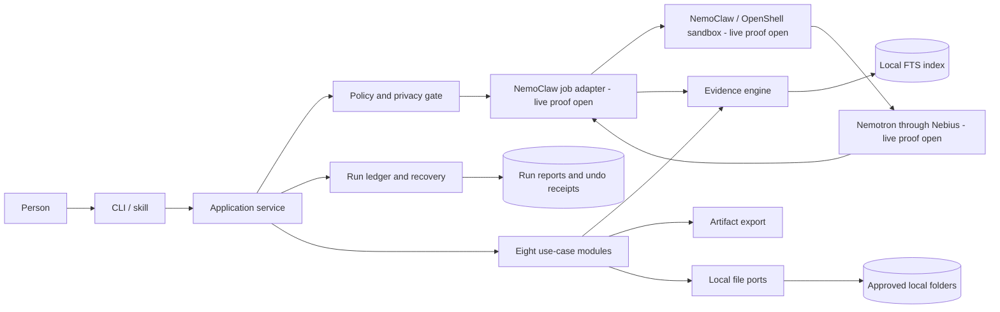

# Architecture

NemoFold uses a local-first hexagonal architecture. The application remains useful
offline; NemoClaw and Nemotron are adapters behind explicit privacy and cost gates.

Text alternative: a person calls one application service through the CLI or the
NemoFold skill. The service invokes eight modules. Local policy, ledger, evidence,
index, files, and export components remain authoritative. Only an already approved job
package can cross the NemoClaw adapter into an OpenShell sandbox and on to Nemotron.
The answer returns to the local evidence engine before it can become a report.

The external nodes are design commitments, not yet live evidence. The offline demo
therefore records `cloud_proof: false`.

See [NemoClaw integration](nemoclaw-integration.md) for the supported skill route and
the separate runtime-plugin route.
