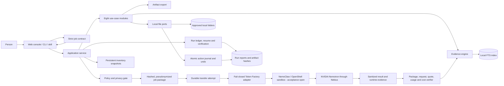

# Architecture

NemoFold uses a local-first hexagonal architecture. The application remains useful
offline; NemoClaw and Nemotron are adapters behind explicit privacy and cost gates.

Text alternative: a person calls one application service through the local web
console, CLI, or NemoFold skill. Every surface uses the same strict job contract. The
service invokes eight modules. Local policy, ledger, evidence, index, files, and export
components remain authoritative. Only an already approved job package can cross the
NemoClaw package route into an OpenShell sandbox and on to Nemotron. Immediately before
network I/O, an atomic attempt receipt makes a duplicate paid retry fail closed. The
answer returns through a verifier that recomputes the request and checks exact quotes,
usage, costs, endpoint, and hashes before it can become evidence.

The adapter and verifier are implemented and tested with simulated transports. The
actual NemoClaw/Nebius acceptance run remains open, so repository demos still record
`cloud_proof: false` unless a real successful result receipt exists. A user-supplied
NemoClaw version is stored only as declared metadata; `nemoclaw_proof` stays false until
a separate, sanitized sandbox-runtime record exists.
Likewise, generic run-report metadata can never promote itself to `cloud_proof: true`;
only the dedicated, hashed provider result-package contract is accepted for that claim.

The authoritative state is deterministic: job snapshots identify the request;
inventory snapshots identify the source set; the persistent index is updated by hash
and prunes deleted sources; the ledger records terminal status; action journals reconcile
crashes before a retry and generate verifiable undo receipts. Transfer-attempt receipts
also prevent an uncertain network failure from becoming an automatic second request.
External language-model output cannot directly mutate any authoritative layer.

See [NemoClaw integration](nemoclaw-integration.md) for the supported skill route and
the separate runtime-plugin route.
