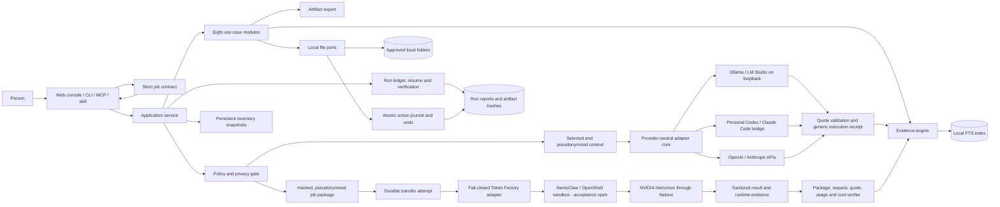

# Architecture

NemoFold uses a local-first hexagonal architecture. The application remains useful
offline; NemoClaw and Nemotron are adapters behind explicit privacy and cost gates.

Text alternative: a person calls one application service through the local web
console, CLI, MCP server, or NemoFold skill. Every surface uses the same strict job
contract. The service invokes eight modules. Local policy, ledger, evidence, index,
files, and export components remain authoritative. The generic adapter route can call
loopback models, personal CLI bridges, or official provider APIs, but accepts a result
only after every quote matches the pseudonymized context supplied for that question.
These runs produce generic execution receipts only. Separately, an already approved
job package can cross the NemoClaw package route into an OpenShell sandbox and on to
Nemotron. Immediately before that network I/O, an atomic attempt receipt makes a
duplicate paid retry fail closed. The answer returns through a competition verifier
that recomputes the request and checks exact quotes, usage, costs, endpoint, and hashes.

The adapter and verifier are implemented and tested with simulated transports. The
actual NemoClaw/Nebius acceptance run remains open, so repository demos still record
`cloud_proof: false` unless a real successful result receipt exists. A user-supplied
NemoClaw version is stored only as declared metadata; `nemoclaw_proof` stays false until
a separate, sanitized sandbox-runtime record exists.
Likewise, generic provider metadata can never promote itself to `cloud_proof: true` or
`competition_proof: true`; only the dedicated, hashed Nebius result-package contract
is accepted for that claim.

The authoritative state is deterministic: job snapshots identify the request;
inventory snapshots identify the source set; the persistent index is updated by hash
and prunes deleted sources; the ledger records terminal status; action journals reconcile
crashes before a retry and generate verifiable undo receipts. Transfer-attempt receipts
also prevent an uncertain network failure from becoming an automatic second request.
External language-model output cannot directly mutate any authoritative layer.

See [NemoClaw integration](nemoclaw-integration.md) for the supported skill route and
the separate runtime-plugin route. See [Provider adapters, local API, and MCP](providers-and-mcp.md)
for the generic execution route and client configuration.

## Diagram choice and source

The primary view is a curated UML-like application architecture bridge: it combines a
C4-style container overview with the one runtime boundary a juror needs to understand.
Its question is "what stays authoritative locally, and what may cross to the model?"
The audience is jurors first and developers second. A sequence diagram is the fallback
for the approved live-run evidence because message order then matters more than topology.

The Mermaid block above is the editable source for the detailed view. The simplified
capture source is in [the jury-demo plan](jury-demo.md), and its accessible deterministic
SVG export is [nemofold-trust-boundary.svg](media/nemofold-trust-boundary.svg). These are
hand-curated explanatory views, not generated reverse-engineering output. They describe
the repository state reviewed on 2026-08-30; the open NemoClaw/Nebius acceptance path is
therefore labeled as open rather than inferred to be working.

## Console-to-contract blueprint

The console has one human wait point: configure a bounded job, inspect its preview, and
decide whether to run it. Everything between that decision and the result is application
logic, not another screen. The fields are the human-readable form of the same strict job
contract used by the CLI and skill:

| Console element | Question it asks | Contract effect | Empty or invalid behavior |
|---|---|---|---|
| Workflow | What job should NemoFold perform? | Selects one of the eight workflow modules | Unknown values are rejected |
| Approved input roots | Which folders may this run read? | Sets the only readable source roots | A missing or out-of-scope root blocks the run |
| Approved target roots | Where may an action workflow write? | Bounds action destinations | Optional for analysis; required and checked for actions |
| Questions | What should the evidence workflow answer? | Preserves ordered questions in the job snapshot | Required by question-driven workflows |
| Privacy | May context remain local, be previewed, or leave once? | Selects `local_only`, `preview`, or `allow_once` | External work blocks without `allow_once` and later live gates |
| Action mode | Is this only a plan or an approved local action? | Selects `dry_run` or `apply` | Apply still blocks unless the server has its action gate |
| Model ID and maximum cost | Which bounded worker may reason, and at what ceiling? | Constrains the external package | Optional locally; a live run requires a Nemotron ID and valid budget |
| Workflow parameters | Which workflow-specific choices apply this time? | Adds strict, typed parameters | Unknown or malformed JSON is rejected rather than ignored |
| Preview exact scope | Is this the intended scope before work begins? | Produces receipts and a no-action preview | Never transfers context or applies file actions |
| Run locally | Execute this accepted job now? | Calls the shared application service | External work remains blocked without the separate live-transfer path |
| Result panel | What happened, what is proven, and what remains open? | Returns the structured run report | Errors and open proof states remain visible |

This mapping makes the control boundary explicit: a click assembles a job-specific
instruction, but it never silently supplies missing permission, model, budget, or action
approval.

## Public synthetic-demo boundary

The normal console is an operator surface and can be given explicit local roots. It is
therefore not the process used for an internet-facing demonstration. `serve-demo` starts
the same UI and application service behind a smaller server contract:

- only `evidence_analyst`, `folder_digest`, `bundle_export`, `version_resolver`, and
  offline `platform_proof` are available;
- the source is one server-selected synthetic fixture and the output is a new temporary
  directory for each request;
- root, target, parameter, privacy, action, model, budget, and resume fields must match
  the public-demo sentinels and cannot expand authority;
- the server generates the run identity, caps parallel work, removes the temporary
  directory after each response, and replaces server paths with `demo://` identifiers;
- the CLI for this surface exposes no external-model or file-action switch.

This closes the technical hosting-preparation gap without pretending that a deployment
URL exists. Hosting remains an outward action and the real Nebius/Nemotron path remains
separately gated.
