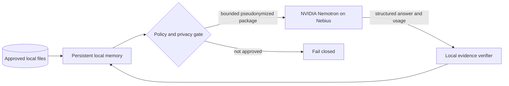

# Three-minute jury demo

This is a **recording-ready plan, not evidence that a public video or live cloud run
already exists**. The final render is blocked while any `{LIVE_*}` marker remains.
Replace those markers only from a successful `verify-result` readback.

## Recommended cut: trust boundary first

Audience: a juror seeing NemoFold for the first time. The primary question is not
"how many features exist?" but "why can I trust this personal agent with my files?"

Text alternative: approved files feed a persistent local memory. Only the policy gate
can create a bounded, pseudonymized package for NVIDIA Nemotron on Nebius. The answer,
usage, and citations return to a local verifier. A missing approval stops at the gate.

Recording export: [accessible SVG](media/nemofold-trust-boundary.svg). Mermaid remains
the editable source; the SVG is the deterministic capture asset.

## Shot list and verbatim narration

The spoken text below is the recording source. Do not improvise measured values or
replace an open state with a success claim.

### 0:00-0:18 — Hook

**Picture:** Captain Nemo console hero, then the twelve workflow names.

**Say:**

> My useful documents are private, scattered across folders, and constantly changing.
> I wanted a personal agent that remembers them, answers with evidence, and can help
> maintain them—without silently taking control of my files.

### 0:18-0:43 — Trust boundary

**Picture:** the simplified architecture above; highlight files, gate, Nemotron, then
the returning verifier arrow.

**Say:**

> NemoFold keeps originals, paths, its persistent index, policy, audit trail, and file
> authority local. When stronger language reasoning is useful, the gate can release
> only selected, pseudonymized chunks with an explicit model and budget. NVIDIA
> Nemotron runs through Nebius, but every returned claim still has to pass the local
> evidence verifier.

### 0:43-1:18 — Evidence Analyst

**Picture:** select Evidence Analyst, preview the synthetic job, run it, then zoom into
two answers, an exact quote/location, conflict hint, and coverage counts.

**Say:**

> Here I ask two questions across a synthetic policy folder. Preview shows the exact
> scope before anything runs. The result separates the questions, cites the source and
> line or PDF page, and shows possible conflicts between older and current wording.
> Coverage also tells me what was read, cited, unsupported, or unreadable. A fluent
> answer without a matching source quote is not promoted to verified evidence.

### 1:18-1:43 — Persistent memory

**Picture:** run Folder Digest, change one synthetic document, rerun, and show the
new/changed/deleted delta plus the local index status.

**Say:**

> This is persistent memory rather than another disposable chat. Folder Digest records
> stable source identities and hashes. When a document changes or disappears, the next
> run reports the delta and updates the local search index. A run can resume from its
> saved snapshot instead of forgetting its previous state.

### 1:43-2:08 — Controlled action

**Picture:** Smart Inbox preview, collision block, approved synthetic apply, action
journal, undo receipt, restored directory.

**Say:**

> Tools remain controlled too. Smart Inbox previews the whole batch and blocks on a
> collision before moving anything. In this synthetic directory I approve one action,
> inspect its journal and undo receipt, and restore the original state. The model can
> propose work; only the local policy layer can authorize it.

### 2:08-2:43 — Mandatory live platform proof

**Picture:** `verify-job`; bounded package; sanitized runtime view; attempt receipt;
result receipt; `verify-result`. Never show a key, Authorization header, personal path,
or raw document text.

**Capture status:** **OPEN — these shots do not exist until the approved live run.**

**Say only after a real successful verified run:**

> After local privacy and integrity checks, one explicit approval sends this package to
> `{LIVE_MODEL_ID}` through the Nebius Token Factory. A durable attempt receipt blocks
> uncertain retries. The response records `{LIVE_INPUT_TOKENS}` input tokens,
> `{LIVE_OUTPUT_TOKENS}` output tokens, and `{LIVE_LATENCY_MS}` milliseconds.
> `verify-result` checks the request, response, usage, cost inputs, and exact quotes.
> The receipt is `{LIVE_RESULT_STATUS}`, with
> `transfer_performed: true` and `cloud_proof: true`.

**Current state:** **OPEN.** Do not record or narrate this paragraph until all five
markers come from the same valid result package.

### 2:43-2:58 — Close

**Picture:** return to the architecture, then the hero and tagline.

**Say:**

> NemoFold lets model reasoning travel without handing over file authority. Its
> persistent memory, evidence, policy, and undo trail remain yours. Your files. Your
> rules. Your agent.

## Alternate opening: workflow first

Use this only as a comparison cut; keep the remainder unchanged.

> One folder arrives. NemoFold can index it, answer questions with exact citations,
> track later changes, select the valid version, build reports, and safely organize the
> files. The same persistent agent does all twelve jobs—but its authority and memory
> remain local.

The trust-boundary opening is recommended because it differentiates NemoFold sooner and
makes the Nebius/Nemotron role understandable before the feature sequence begins.

## Capture checklist

1. Use only `examples/synthetic-home` and the committed example jobs.
2. Start the console on loopback; keep browser zoom and window size fixed.
3. Capture the success, coverage-gap, collision-block, apply, and undo states as
   separate reusable clips.
4. Capture the architecture as a crisp SVG or browser render with its text alternative
   retained in the public documentation.
5. Capture the live segment only after `verify-job` and `verify-result` both succeed on
   the same immutable package.
6. Replace every `{LIVE_*}` marker from that package, then search the entire narration
   for remaining braces. Removing the markers intentionally breaks the draft guard test;
   the same reviewed commit must replace it with validation against the preserved result
   artifact and its hash.
7. Export one voice-only master. If music is used, also export a ducked comparison;
   spoken words must remain clearly intelligible.
8. Use `ffprobe` to verify that the final duration is below 180 seconds and audio is
   present before any upload.

## Final evidence gate

The media package is **fast, not complete** while the live segment, final render,
duration/audio readback, public YouTube URL, and user selection between variants
are open. No screenshot, mock response, or simulated transport can close those items.
